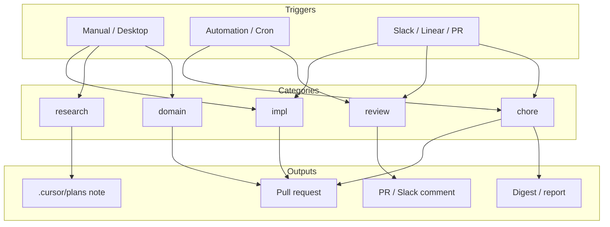

# Agent reorganization proposal

Proposal for making Cursor agents in this workspace easier to find, cheaper to run, and clearer to invoke.

## Current state (audit)

| Layer | What exists today | Problem |
| --- | --- | --- |
| Cloud agent runs | 1 active run in this environment (`qing-hkust/cursor`) | Flat list; no naming scheme for future growth |
| Environments | Single lean `.cursor/environment.json` (matplotlib) | Fine for this repo; will not scale if agents span unrelated work |
| Instructions | One root `AGENTS.md` | Good start, but mixes “how to boot” with future domain guidance |
| Project rules | None under `.cursor/rules/` | No categorized, scoped conventions |
| Skills / plugins | Many global plugins (HF, Exa, Firecrawl, Context7) | Useful, but uncategorized and easy to over-trigger |
| Automations | None observed in-repo | Flat dashboard later; need naming before you grow |

Cursor’s agents dashboard is still largely a **flat list** (folders/tags for automations are a requested feature). So organization has to come from **naming, environments, rules folders, and when you archive**.

## Target model: five agent categories

Organize every agent (manual cloud run, automation, or specialist skill) into exactly one primary category:

| ID | Category | Job | Typical trigger | Should open a PR? |
| --- | --- | --- | --- | --- |
| `impl` | Implement | Ship a scoped code change | Manual / Slack / Linear | Yes |
| `review` | Review | Critique diffs, security, style | PR open/push | Usually comments only |
| `chore` | Chore | Deps, tests, digests, cleanup | Schedule / webhook | Sometimes |
| `research` | Research | Papers, model pick, docs lookup | Manual | Rarely (notes/plans) |
| `domain` | Domain | Scientific plotting / matplotlib house style | Manual when editing plots | Yes when changing code |

Keep each run **single-purpose**. If a task spans implement + review, split into two agents or do review after the PR exists.



## Naming convention (works without dashboard folders)

Use this pattern for **cloud agent titles**, **automation names**, and **branch prefixes**:

```text
[<category>] <repo-or-area>: <outcome>
```

Examples:

- `[impl] cursor: add dual-axis scientific plot helper`
- `[review] cursor: security pass on open PRs`
- `[chore] cursor: weekly dependency refresh`
- `[research] hf: best local GGUF for paper summarization`
- `[domain] cursor: tighten legend spacing defaults`

Branch names (already using `cursor/…-637a` here) can stay as-is; the **agent title** is what you scan in the dashboard.

### Archive policy

| Status | Action |
| --- | --- |
| Done + PR merged/closed | Archive within 7 days |
| Error / abandoned | Archive same day; keep name for search |
| Long-running / waiting | Keep only if still actionable; otherwise kill + archive |

## Repo layout (how to reorganize the config)

Proposed structure (scaffolded in this PR):

```text
.
├── AGENTS.md                          # short index + boot checklist only
├── docs/
│   └── agent-organization.md          # this proposal
└── .cursor/
    ├── environment.json               # lean install (unchanged)
    ├── rules/
    │   ├── core/                      # always-on / boot / safety
    │   │   └── cloud-boot.mdc
    │   ├── domain/                    # scientific plotting
    │   │   └── scientific-plots.mdc
    │   └── quality/                   # review conventions
    │       └── pr-hygiene.mdc
    └── skills/                        # optional repo skills (on demand)
        └── README.md
```

### What goes where

| Put it in… | When… | Loaded how |
| --- | --- | --- |
| `AGENTS.md` | Every agent needs it in ≤1 screen (boot, verify, layout) | Always |
| `.cursor/rules/core/` | Cross-cutting conventions | `alwaysApply` or intelligent |
| `.cursor/rules/domain/` | Plot / science-specific style | globs on `*.py` or intelligent |
| `.cursor/rules/quality/` | PR / review expectations | intelligent / manual `@` |
| `.cursor/skills/` | Long workflows (debug, HF job recipe) | On demand by description |
| User / team rules | Personal taste or org-wide policy | Dashboard / Settings |
| Automations | Recurring review/chore | cursor.com/automations |

**Rule:** keep always-on context small. Push deep recipes into skills so implement agents stay fast.

## Efficiency levers (categorization → speed/cost)

1. **Environment per job type** — keep this repo’s environment lean (already good). Do not install HF/torch here unless a `domain`/`research` agent truly needs it; use a separate environment or repo for ML agents.
2. **Category-matched tools** — `research` → Exa/Context7/HF; `impl`/`domain` → local code + matplotlib verify; `review` → diff + lint only.
3. **One outcome per run** — naming forces scope; smaller diffs, fewer retries.
4. **Plan for ambiguous work** — save plans under `.cursor/plans/` with the same `[category]` prefix so later agents inherit intent.
5. **Filter the dashboard** — until folders exist, use category prefixes + lifecycle filters (`RUNNING` / archived / “made code changes” / “created PR”).

## Suggested starter automations (optional, later)

Only add these when the manual pattern is proven:

| Name | Category | Trigger | Does |
| --- | --- | --- | --- |
| `[chore] cursor: weekly repo digest` | chore | Weekly cron | Summarize merged PRs to Slack/email |
| `[review] cursor: PR hygiene` | review | PR opened | Check naming, AGENTS.md touch, plot regen if needed |
| `[domain] cursor: regenerate example plot` | domain | Push touching `scientific_plot.py` | Run `python3 example_scientific_plot.py`, commit PNG if changed |

## Migration checklist (how to reorganize)

Do this in order; each step is independently useful.

1. **Adopt the naming prefix** for every new cloud agent starting today (`[impl]`, `[review]`, …).
2. **Keep `AGENTS.md` as the index** — boot + verify only; link out to `docs/agent-organization.md`.
3. **Land categorized rules** under `.cursor/rules/{core,domain,quality}/` (scaffolded in this PR).
4. **Archive finished runs** so the active list stays category-readable.
5. **Split environments by workload** if you add ML/HF agents — do not bloat this scientific-plot environment.
6. **Add automations last**, using the same `[category]` names so the automations list stays scannable without folders.
7. **Prune global skills/plugins** you never invoke; prefer a few high-signal skills with clear “when to use” text.

## Success criteria

- You can glance at cursor.com/agents and group work by the `[category]` prefix in under 5 seconds.
- Implement/domain agents finish with a PR; research agents leave a plan/note, not drive-by refactors.
- Cold start for this repo stays fast (`pip install -r requirements.txt` + plot verify).
- Always-on rule text stays short; deep workflows live in skills.
