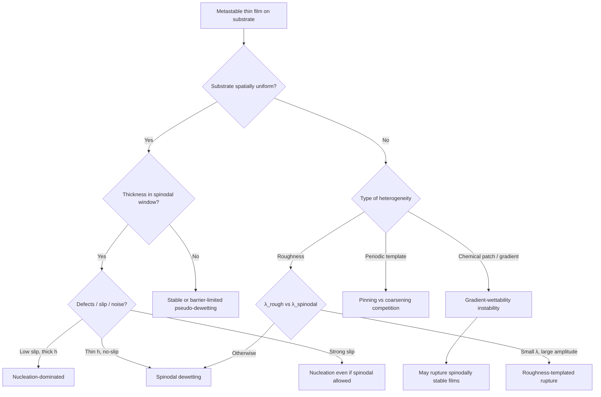

# Literature review: Mechanistic models of dewetting on non-ideal substrates

**Focus:** Thin liquid/polymer/metal films on solid supports; **rupture mechanisms** (nucleation, spinodal, heterogeneous-gradient-driven); how **substrate imperfections**—chemical patches, roughness, patterned templates, slip, and fluctuations—alter the governing physics relative to the ideal homogeneous case.

**Generated:** 2026-07-16

---

## Executive summary

Dewetting of metastable thin films is one of the best-developed examples of **interfacial hydrodynamics coupled to long-range molecular forces**. On a **perfect, homogeneous, non-wetting substrate**, two classical rupture pathways compete:

| Mechanism | Driving physics | Typical signature | Key references |
|-----------|-----------------|-------------------|----------------|
| **Spinodal dewetting** | Linear instability of a flat film; capillary waves amplified by **disjoining pressure** (van der Waals / polar contributions) | Correlated hole pattern; dominant wavelength \(\lambda_m \propto h^2\) (film thickness \(h\)); exponential growth of undulation amplitude | Bischof *et al.* 1996; Xie *et al.* 1998; Herminghaus *et al.* 1998 |
| **Nucleation & growth** | Overcoming a **free-energy barrier** to form a dry patch (homogeneous or defect-triggered) | Uncorrelated holes; nucleation rate sensitive to defects, slip, thickness | Reiter 1992; Thiele *et al.* 2001; Lessel *et al.* 2017 |

The **canonical continuum model** is the **thin-film (lubrication) equation** with **disjoining pressure** \(\Pi(h)\), derived by long-wave reduction (Oron–Davis–Bankoff 1997). Linear stability yields a fastest-growing mode; nonlinear dynamics produce holes, rims, and droplets.

**Non-ideal substrates** break the spatial homogeneity assumed in that baseline. Literature distinguishes several mechanistic classes:

1. **Chemical heterogeneity (wettability patches / gradients):** Instability can be driven by **gradients in intermolecular potential** rather than uniform repulsion. Rupture times can be **orders of magnitude faster** than spinodal dewetting; spinodally **stable** films may still break up. Morphologies include ripples, castle–moat structures, and templated stripe patterns (Konnur *et al.* 2000; Sharma group; Kotni *et al.* 2022 review).
2. **Topographical roughness:** Roughness provides **preferred rupture sites** and can **template** the dewetted morphology when roughness wavelength is sub-spinodal and amplitude is large enough; otherwise spinodal modes dominate (Volodin & Kondyurin 2008).
3. **Deliberate templates (periodic stripes, pillars):** Competition between **pinning** (locking contact lines to wettable features) and **coarsening** (Ostwald ripening of droplets) sets design rules for lithography-free patterning (Brusch *et al.* 2002; Kargupta & Sharma 2001; Mukherjee *et al.* 2008).
4. **Slip and interfacial mobility:** Strong **hydrodynamic slip** (e.g., hydrophobic SAM substrates) can switch the apparent mechanism from spinodal to **nucleation-dominated** breakup even when thermodynamics favor spinodal instability (Lessel *et al.* 2017; Rauscher *et al.* 2008).
5. **Thermal fluctuations (nanoscale):** At nm thickness, **stochastic lubrication equations** show fluctuation-driven rupture; chemical heterogeneity can often be mapped to **effective** slip and Hamaker constants (Zhao *et al.* 2023).

**Design implication:** On real surfaces—contaminated, oxidized, polycrystalline, or intentionally patterned—dewetting is rarely “pure spinodal.” Models must specify **local \(\Pi(h,\mathbf{x})\)**, **topography \(z_s(\mathbf{x})\)**, **slip length \(b(\mathbf{x})\)**, and whether **barriers** (secondary minima in disjoining pressure) permit only pseudo-dewetting on homogeneous substrates but **true rupture** once gradients appear.

---

## 1. Foundational mechanistic framework (homogeneous substrate)

### 1.1 Thin-film equation and disjoining pressure

For a film of thickness \(h(\mathbf{x},t)\) on a rigid substrate, the lubrication-scale evolution equation (schematic form) is:

\[
\frac{3\eta}{h^3}\,\partial_t h = \nabla\cdot\left(h^3 \nabla\bigl(\gamma \nabla^2 h - \Pi(h)\bigr)\right),
\]

where \(\eta\) is viscosity, \(\gamma\) air–liquid surface tension, and \(\Pi(h)\) the **disjoining pressure** from van der Waals, polar, structural, or electrostatic contributions. On a **uniform** non-wetting substrate, \(\Pi(h)\) is typically **destabilizing** at finite \(h\) (negative derivative \(\mathrm{d}\Pi/\mathrm{d}h < 0\) in the unstable window).

**Oron, Davis & Bankoff** (*Rev. Mod. Phys.* 1997) unify derivations including van der Waals attractions, thermocapillarity, evaporation, and substrate curvature. [DOI 10.1103/RevModPhys.69.931](https://doi.org/10.1103/RevModPhys.69.931)

**Mitlin** (1993) and **Brochard–Daillant** / **Vrij–Overbeek** established the analogy between dewetting and **spinodal decomposition**, with a fastest-growing wavenumber \(q_m\) and growth rate \(R_m\) depending on \(\Pi''(h)\), \(\gamma\), and \(\eta\).

### 1.2 Spinodal vs nucleation: thickness-dependent crossover

Experiments on polymers and liquid metals established that **both** mechanisms coexist:

- **Bischof, Scherer, Herminghaus & Leiderer** (*PRL* 1996): First unambiguous observation of **spinodal** surface waves in liquid Au/Cu/Ni on fused silica, distinct from **heterogeneous hole nucleation**; \(\lambda_m \propto h^2\). [DOI 10.1103/PhysRevLett.77.1536](https://doi.org/10.1103/PhysRevLett.77.1536)
- **Xie, Karim, Douglas, Han & Weiss** (*PRL* 1998): PS on Si—thick films (\(h \gtrsim 10\) nm) nucleate holes; thinner films dewet spinodally with exponential growth of capillary-wave amplitude matching linear theory. [DOI 10.1103/PhysRevLett.81.1251](https://doi.org/10.1103/PhysRevLett.81.1251)
- **Thiele, Velarde & Neuffer** (*PRL* 2001): Even inside the **linearly unstable** thickness band, a sub-range exists where **nucleation sets the final structure** and spinodal growth is negligible—important when interpreting “which mechanism wins.” [DOI 10.1103/PhysRevLett.87.016104](https://doi.org/10.1103/PhysRevLett.87.016104)
- **Thiele, Mertig & Pompe** (*PRL* 1998): Evaporating films show **heterogeneous nucleation at large \(h\)** crossing over to **spinodal rupture below ~10 nm**; humidity shifts the balance. [DOI 10.1103/PhysRevLett.80.2869](https://doi.org/10.1103/PhysRevLett.80.2869)

**Becker, Grün, Seemann, Mantz, Jacobs, Mecke & Herminghaus** (*Nature Materials* 2002) catalog complex **late-stage morphologies** (fractals, polygonal networks) captured by thin-film models beyond linear theory. [DOI 10.1038/nmat788](https://doi.org/10.1038/nmat788)

### 1.3 Pseudo-dewetting and secondary minima

When \(\Pi(h)\) has **two minima** (primary adsorbed layer + secondary metastable film), homogeneous-substrate spinodal breakup may stop at the **secondary minimum** (“pseudo-dewetting”) because true dry-out requires surmounting an **energy barrier**. **Chemical heterogeneity** can supply the gradient work to reach the primary minimum—central to Sharma-group models and the Kotni *et al.* (2022) review synthesis. [DOI 10.1080/01411594.2022.2094267](https://doi.org/10.1080/01411594.2022.2094267)

---

## 2. Modeling non-ideal substrates: taxonomy of imperfections

Real substrates depart from uniformity along **chemistry**, **topography**, **hydrodynamic boundary condition**, and **noise**. The table below maps imperfection type → model modification → qualitative effect.

| Imperfection | Model ingredient | Mechanistic consequence |
|--------------|----------------|-------------------------|
| Chemical patch / stripe | \(\Pi(h,\mathbf{x})\) or local Hamaker / spreading coefficient | **Gradient-driven flow**; localized rupture; templating; can destabilize stable films |
| Roughness | \(h \to h - z_s(\mathbf{x})\); local curvature in \(\Pi\) | **Roughness-triggered rupture** vs spinodal wavelength selection |
| Topographic pattern (pillars, grooves) | Confinement + contact-line pinning | Reduced length scale; ordered droplet arrays; stick–slip rims |
| Defects / dust | Heterogeneous nucleation boundary condition | Uncorrelated holes; shifts mechanism to nucleation |
| Slip heterogeneity | \(b(\mathbf{x})\) in slip-enhanced thin-film equation | Alters dispersion relation; can **switch** spinodal ↔ nucleation |
| Thermal noise (nm films) | Stochastic lubrication equation | Lowers effective stability threshold; early-time spectra |

---

## 3. Chemical heterogeneity

### 3.1 Gradient-wettability mechanism (distinct from spinodal)

**Konnur, Kargupta & Sharma** (*PRL* 2000; *Langmuir* 2000) identify a **new instability** on chemically heterogeneous substrates: dewetting driven by **microscale wettability contrast** and **gradient of intermolecular interactions**, not merely average non-wettability.

Key predictions (simulations + theory):

- Rupture time **\(\propto 1/\)**(potential difference across heterogeneity).
- Can be **orders of magnitude faster** than homogeneous spinodal dewetting.
- **Spinodally stable** films may rupture.
- Morphologies: **ripples**, **castle–moat**, radial structures; holes may form **without** prior spinodal undulations.

[DOI 10.1103/PhysRevLett.84.931](https://doi.org/10.1103/PhysRevLett.84.931) · [DOI 10.1021/la000759o](https://doi.org/10.1021/la000759o)

**Sharma, Konnur & Kargupta** (*Physica A* 2003) extend to films with **primary + secondary minima**: heterogeneity enables **true rupture** at the primary minimum by overcoming the barrier separating minima—unavailable on homogeneous substrates. [DOI 10.1016/S0378-4371(02)01429-2](https://doi.org/10.1016/S0378-4371(02)01429-2)

### 3.2 Patterned stripes and templating

**Kargupta & Sharma** (*PRL* 2001; *JCIS* 2002; *JCP* 2002) formulate **templating rules** for alternating wettable / less-wettable stripes:

- Ideal replication of substrate pattern requires stripe period **\(> \lambda_h\)** (heterogeneous instability length, near spinodal \(\lambda_m\)) and sufficiently narrow less-wettable stripes.
- Closely spaced destabilizing sites can be **silenced** (“not all sites stay live”) by hydrodynamic coupling.

[DOI 10.1103/PhysRevLett.86.4536](https://doi.org/10.1103/PhysRevLett.86.4536) · [DOI 10.1006/jcis.2001.7860](https://doi.org/10.1006/jcis.2001.7860)

**Thiele, Mertig, Pompe** (*Eur. Phys. J. E* 2003) and **Brusch, Kühne, Thiele & Bär** (*Phys. Rev. E* 2002) analyze **pinning vs coarsening** on periodic templates using bifurcation theory. Substrate modulation enters as \(\kappa(x) = 1 + \varepsilon\cos(2\pi x/P_\mathrm{het})\) scaling disjoining pressure. **Weak heterogeneity** can pin desired stripe patterns if \(P_\mathrm{het}\) exceeds the critical spinodal period; a broad **multistability** region separates pinned and coarsened states. [DOI 10.1103/PhysRevE.66.011602](https://doi.org/10.1103/PhysRevE.66.011602) · [DOI 10.1140/epje/i2003-10019-5](https://doi.org/10.1140/epje/i2003-10019-5)

### 3.3 Shape of heterogeneity and dry-spot nucleation

**Simmons & Chauhan** (*JCIS* 2006): geometry of **physical and chemical** heterogeneities affects rupture location and kinetics. [DOI 10.1016/j.jcis.2005.09.009](https://doi.org/10.1016/j.jcis.2005.09.009)

**Darhuber group** (*Microfluid. Nanofluid.* 2011): **dry-spot nucleation** on chemically patterned surfaces bridges nucleation and film stability theory. [DOI 10.1007/s10404-011-0836-z](https://doi.org/10.1007/s10404-011-0836-z)

**Kao, Golovin & Davis** (*JCIS* 2006): **resonant substrate patterning**—when pattern wavenumber matches spinodal mode, rupture accelerates. [DOI 10.1016/j.jcis.2006.08.015](https://doi.org/10.1016/j.jcis.2006.08.015)

### 3.4 Recent work (measurement & fluctuations)

**Richter, Malgaretti & Harting** (*J. Chem. Phys.* 2025): linear stability + nonlinear simulations of dewetting on **chemically patterned** flat substrates; propose inferring **surface-energy landscapes** from early-time height profiles. [DOI 10.1063/5.0268099](https://doi.org/10.1063/5.0268099)

**Zhao, Zhang & Si** (*J. Chem. Phys.* 2023): **stochastic lubrication equation** + MD for nm films on chemically heterogeneous substrates; heterogeneity often reducible to **effective slip + Hamaker**; gradient corrections weak for instability onset. [DOI 10.1063/5.0159155](https://doi.org/10.1063/5.0159155)

---

## 4. Topographical roughness and combined patterns

### 4.1 Roughness vs spinodal wavelength (Volodin–Kondyurin)

**Volodin & Kondyurin** (*J. Phys. D* 2008, theory + experiment on etched Si) give a clear **phase diagram** in \((\lambda_\mathrm{rough}, A_\mathrm{rough}, h)\):

1. \(\lambda_\mathrm{rough} \gg \lambda_\mathrm{spinodal}\) → **spinodal dewetting** (roughness merely perturbs).
2. \(\lambda_\mathrm{rough} < \lambda_\mathrm{spinodal}\) and **roughness amplitude large** vs \(h\) → **roughness-templated** breakup; dewetted pattern **replicates** substrate periodicity.
3. \(\lambda_\mathrm{rough} < \lambda_\mathrm{spinodal}\) but **small amplitude** → spinodal dewetting proceeds.

[DOI 10.1088/0022-3727/41/6/065306](https://doi.org/10.1088/0022-3727/41/6/065306) · [DOI 10.1088/0022-3727/41/6/065307](https://doi.org/10.1088/0022-3727/41/6/065307)

### 4.2 Physical pre-patterns (pillars, mesas)

**Mukherjee, Bandyopadhyay & Sharma** (*Soft Matter* 2008): 2D pillar arrays **confine** dewetting; thin conformal films form **ordered droplet arrays** in interstices; thicker films show **multi-scale** hole nucleation uncorrelated with pattern. [DOI 10.1039/b806925e](https://doi.org/10.1039/b806925e)

**Yoon *et al.*** (*Soft Matter* 2008): topographic pre-pattern **reduces** feature size (~300% pattern reduction to ~70 nm caps from 200 nm mesas). [DOI 10.1039/B800121A](https://doi.org/10.1039/B800121A)

**Dewetting on periodic physical + chemical patterns** (*Langmuir* 2002): combined patterning offers additional morphological control. [DOI 10.1021/la010469n](https://doi.org/10.1021/la010469n)

---

## 5. Slip, viscosity, and mechanism switching

On **high-slip** substrates (e.g., PS on hydrophobic DTS SAM vs SiO\(_2\)), **Lessel, McGraw, Bäumchen & Jacobs** (*arXiv:1701 / Langmuir ecosystem*, 2017) show:

- SiO\(_2\) (no-slip): **spinodal** breakup with correlated holes.
- DTS (strong slip): **random nucleation** despite similar thermodynamic instability; Minkowski functional analysis excludes spinodal correlations.
- Nucleation barrier model with conical hole profile gives critical radii comparable to **unsupported films**.

**Rauscher, Blossey, Münch & Wagner** (*Langmuir* 2008): **large interfacial slip** modifies the spinodal dispersion relation—implications for interpreting “missing” spinodal signatures on slippery substrates. [DOI 10.1021/la802260b](https://doi.org/10.1021/la802260b)

**Zhang** (*J. Fluid Mech.* 2024): linear stability with **disjoining pressure + strong slip + thermal fluctuations**—unifies nanoscale corrections to classical theory. [DOI 10.1017/jfm.2024.701](https://doi.org/10.1017/jfm.2024.701)

---

## 6. Defects, contaminants, and “hidden” heterogeneity

Even nominally homogeneous substrates often dewet by **heterogeneous nucleation**:

- Dust, voids, oxide patches, local SAM defects, and **delamination buckles** (Stange & Evans 1997) seed holes.
- **Jacobs *et al.*** (*Langmuir* 1998) emphasized air bubbles and defects mimicking spinodal hole density scaling.

**Practical reading:** A **random hole distribution** usually signals nucleation on defects; **correlated length scales** (\(q_m h \sim \mathcal{O}(1)\)) support spinodal instability. On imperfect substrates, **both** may operate in parallel (Bischof 1996; Thiele 1998).

---

## 7. Synthesis: choosing a mechanistic model



### Model selection checklist

1. **Measure or parameterize** \(\gamma\), \(\eta\), \(\Pi(h)\) (Hamaker, polar terms) and whether a **secondary minimum** exists.
2. **Map substrate** to \(\Pi(h,\mathbf{x})\), \(z_s(\mathbf{x})\), and slip \(b(\mathbf{x})\).
3. **Linear stability** on the local base state: growth rate \(R(q)\) vs wavenumber \(q\) (homogeneous) or on patterned base states (Thiele/Brusch bifurcation).
4. **Compare length scales:** \(\lambda_m\), \(\lambda_h\), template period \(P_\mathrm{het}\), \(\lambda_\mathrm{rough}\).
5. **Nonlinear stage:** rim formation, coarsening, evaporation (Thiele 1998), and fluctuation corrections if \(h \lesssim 100\) nm.

---

## 8. Open questions and modeling gaps

1. **Coupled chemo-topographic defects:** Most theory treats chemical and physical heterogeneity separately; real surfaces combine both (native oxide on rough metal, contaminated SAMs).
2. **Viscoelastic / glassy films:** Polymer literature above \(T_g\) vs below; entanglement slows spinodal growth—mechanism identification harder on imperfect supports.
3. **Solid-state dewetting:** Metallic or semiconductor films add **crystalline anisotropy, grain-boundary grooving, and stress**—heterogeneous nucleation at GBs parallels chemical patches but with elastocapillary coupling (not covered in liquid-film models above).
4. **Inverse problem:** Richter *et al.* 2025 suggests early-time profiles infer surface-energy patterns—needs benchmarking on known imperfect substrates.
5. **Barrier crossing:** Quantitative prediction of when heterogeneity drives **true vs pseudo-dewetting** with secondary \(\Pi(h)\) minima remains sensitive to noise and defect density.

---

## 9. Key papers (curated)

| Topic | Reference | DOI |
|-------|-----------|-----|
| Foundational thin-film theory | Oron, Davis & Bankoff, *Rev. Mod. Phys.* 1997 | [10.1103/RevModPhys.69.931](https://doi.org/10.1103/RevModPhys.69.931) |
| Spinodal vs nucleation (metals) | Bischof *et al.*, *PRL* 1996 | [10.1103/PhysRevLett.77.1536](https://doi.org/10.1103/PhysRevLett.77.1536) |
| Spinodal polymers | Xie *et al.*, *PRL* 1998 | [10.1103/PhysRevLett.81.1251](https://doi.org/10.1103/PhysRevLett.81.1251) |
| Nucleation inside spinodal band | Thiele *et al.*, *PRL* 2001 | [10.1103/PhysRevLett.87.016104](https://doi.org/10.1103/PhysRevLett.87.016104) |
| Chemical heterogeneity mechanism | Konnur *et al.*, *PRL* 2000 | [10.1103/PhysRevLett.84.931](https://doi.org/10.1103/PhysRevLett.84.931) |
| Pinning vs coarsening | Brusch *et al.*, *PRE* 2002 | [10.1103/PhysRevE.66.011602](https://doi.org/10.1103/PhysRevE.66.011602) |
| Rough substrate theory + experiment | Volodin & Kondyurin, *J. Phys. D* 2008 | [10.1088/0022-3727/41/6/065306](https://doi.org/10.1088/0022-3727/41/6/065306) |
| Slip switches mechanism | Lessel *et al.*, 2017 | [10.22028/d291-28891](https://doi.org/10.22028/d291-28891) |
| Fluctuations + heterogeneity | Zhao *et al.*, *JCP* 2023 | [10.1063/5.0159155](https://doi.org/10.1063/5.0159155) |
| Pattern inference (recent) | Richter *et al.*, *JCP* 2025 | [10.1063/5.0268099](https://doi.org/10.1063/5.0268099) |
| **Review (substrates)** | Kotni, Sarkar & Khanna, *Phase Transitions* 2022 | [10.1080/01411594.2022.2094267](https://doi.org/10.1080/01411594.2022.2094267) |
| Patterned dewetting review | Mukherjee & Sharma, *Prog. Polym. Sci.* 2010 | [10.1016/j.progpolymsci.2010.07.004](https://doi.org/10.1016/j.progpolymsci.2010.07.004) |

---

## 10. Suggested reading order

1. Oron–Davis–Bankoff (1997) — mathematical backbone.
2. Bischof (1996) + Xie (1998) — experimental mechanism identification on ideal supports.
3. Konnur / Sharma (2000–2003) — chemical heterogeneity as a **distinct** instability class.
4. Brusch / Thiele (2002–2003) — templates, pinning, bifurcations.
5. Volodin & Kondyurin (2008) — roughness competition with spinodal modes.
6. Kotni *et al.* (2022) — integrated substrate-centric review.
7. Zhao (2023) + Richter (2025) — nanoscale and inverse-problem frontiers.

---

## References (BibTeX snippet)

```bibtex
@article{Oron1997,
  author  = {Oron, Alexander and Davis, Stephen H. and Bankoff, S. George},
  title   = {Long-scale evolution of thin liquid films},
  journal = {Reviews of Modern Physics},
  volume  = {69}, pages = {931--980}, year = {1997},
  doi     = {10.1103/RevModPhys.69.931}
}
@article{Konnur2000,
  author  = {Konnur, Rahul and Kargupta, Kajari and Sharma, Ashutosh},
  title   = {Instability and Morphology of Thin Liquid Films on Chemically Heterogeneous Substrates},
  journal = {Physical Review Letters},
  volume  = {84}, pages = {931--934}, year = {2000},
  doi     = {10.1103/PhysRevLett.84.931}
}
@article{Brusch2002,
  author  = {Brusch, Lutz and K{\"u}hne, Heiko and Thiele, Uwe and B{\"a}r, Markus},
  title   = {Dewetting of thin films on heterogeneous substrates: Pinning versus coarsening},
  journal = {Physical Review E},
  volume  = {66}, pages = {011602}, year = {2002},
  doi     = {10.1103/PhysRevE.66.011602}
}
@article{Volodin2008,
  author  = {Volodin, Pylyp and Kondyurin, Alexey},
  title   = {Dewetting of thin polymer film on rough substrate: I. Theory},
  journal = {Journal of Physics D: Applied Physics},
  volume  = {41}, pages = {065306}, year = {2008},
  doi     = {10.1088/0022-3727/41/6/065306}
}
@article{Kotni2022,
  author  = {Kotni, Tirumala Rao and Sarkar, Jayati and Khanna, Rajesh},
  title   = {Dewetting of thin wetting film supported by different solid substrates: a review},
  journal = {Phase Transitions},
  volume  = {95}, pages = {551--566}, year = {2022},
  doi     = {10.1080/01411594.2022.2094267}
}
```
