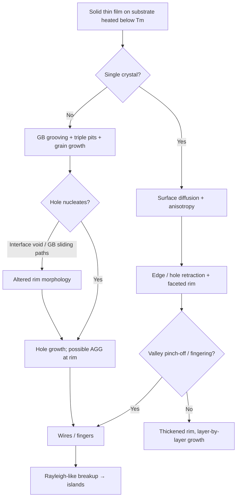
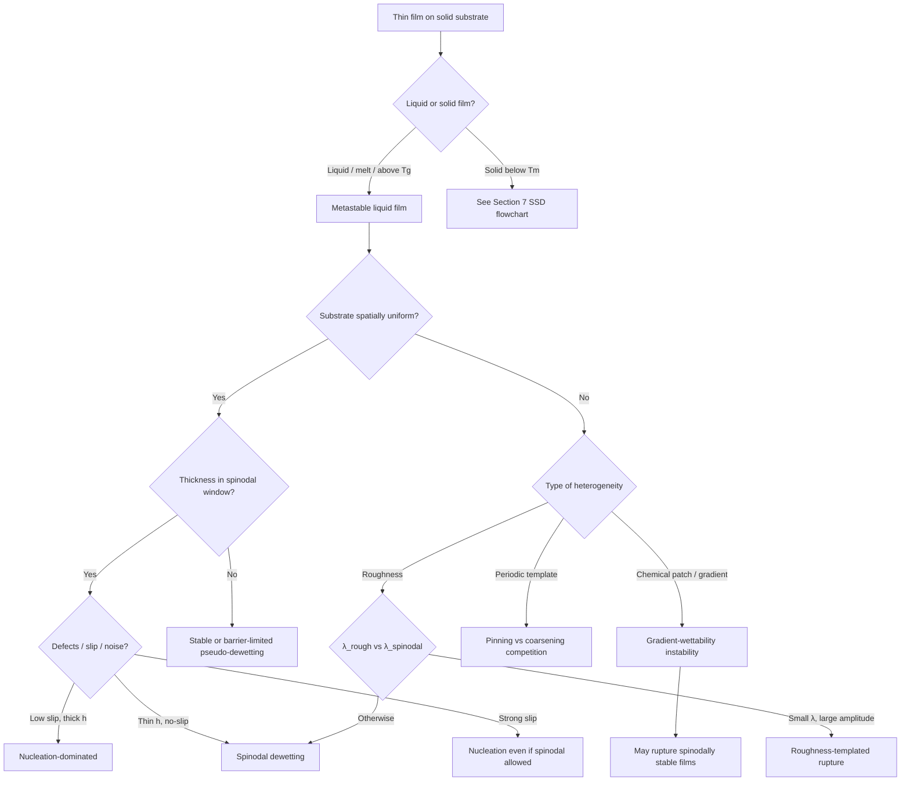

# Literature review: Mechanistic models of dewetting on non-ideal substrates

**Focus:** Thin **liquid** and **solid** films on solid supports; rupture and agglomeration mechanisms; how **substrate and film imperfections**—chemical patches, roughness, grain boundaries, crystallographic anisotropy, patterned templates, slip, and fluctuations—alter the governing physics relative to the ideal homogeneous case.

**Generated:** 2026-07-16 · **Updated:** 2026-07-17 (expanded solid-state dewetting)

---

## Executive summary

Dewetting literature splits into two related but mechanistically distinct families:

| Family | Transport | Continuum backbone | Typical *T* | Signature |
|--------|-----------|--------------------|-------------|-----------|
| **Liquid-film dewetting** | Hydrodynamics + disjoining pressure | Thin-film / lubrication equation | Above melting / $`T_g`$ | Spinodal undulations or nucleated holes → droplets |
| **Solid-state dewetting (SSD)** | Capillary-driven **surface (and GB/interface) diffusion** | Mullins surface diffusion; faceted / anisotropic extensions | Well **below** $`T_m`$ (often $`\sim 0.3`$–$`0.5\,T_m`$) | Hole nucleation → edge retraction + rim → pinch-off / Rayleigh breakup → islands |

### Liquid films (brief)

On a perfect homogeneous non-wetting substrate, **spinodal** (correlated $`\lambda_m \propto h^2`$) and **nucleation** compete (Bischof 1996; Xie 1998; Thiele 2001). The canonical model is the lubrication equation with $`\Pi(h)`$ (Oron–Davis–Bankoff 1997). **Non-ideal substrates** add chemical-gradient instabilities, roughness templating, pinning vs coarsening on patterns, slip-induced mechanism switching, and fluctuation-driven rupture (Sections 1–6).

### Solid films on solid substrates (this update)

Solid films are usually **metastable as deposited** and agglomerate when heated via **surface-energy minimization**, without melting (**Thompson**, *Annu. Rev. Mater. Res.* 2012). Key mechanistic ingredients that have **no liquid-film analogue**:

1. **Grain-boundary (GB) grooving** (Mullins 1957) and **triple-junction pitting** (Srolovitz & Safran 1986) as hole-nucleation pathways in polycrystalline films.
2. **Edge retraction with rim / valley** morphology governed by $`V_n = -B\nabla_s^2\kappa`$ (isotropic) or faceted anisotropic kinetics (Ye & Thompson; Zucker *et al.*; Chame & Pierre-Louis).
3. **Surface-energy anisotropy** → orientation-dependent retraction rates, fingering vs stable facets, anisotropic Rayleigh-like breakup of wires (Kim & Thompson 2014).
4. **Extra mass-transport paths:** GB diffusion, film–substrate interface diffusion, GB sliding (Rabkin group)—can suppress classical elevated rims.
5. **Templated SSD** on patterned films or substrates for ordered nanoparticle arrays (Giermann & Thompson; Ye & Thompson).

**Design implication:** Choose the model family by phase state. Liquid models need local $`\Pi(h,\mathbf{x})`$, topography, and slip. Solid models need $`\gamma(\mathbf{n})`$, contact angle / Young condition at the three-phase line, GB energies, diffusivities ($`D_s`$, $`D_\mathrm{GB}`$, $`D_\mathrm{int}`$), and whether the film is single-crystal or polycrystalline.

---

## 1. Foundational mechanistic framework (homogeneous substrate)

### 1.1 Thin-film equation and disjoining pressure

For a film of thickness $`h(\mathbf{x},t)`$ on a rigid substrate, the lubrication-scale evolution equation (schematic form) is:


$$
\frac{3\eta}{h^3}\,\partial_t h = \nabla\cdot\left(h^3 \nabla\bigl(\gamma \nabla^2 h - \Pi(h)\bigr)\right),
$$


where $`\eta`$ is viscosity, $`\gamma`$ air–liquid surface tension, and $`\Pi(h)`$ the **disjoining pressure** from van der Waals, polar, structural, or electrostatic contributions. On a **uniform** non-wetting substrate, $`\Pi(h)`$ is typically **destabilizing** at finite $`h`$ (negative derivative $`\mathrm{d}\Pi/\mathrm{d}h < 0`$ in the unstable window).

**Oron, Davis & Bankoff** (*Rev. Mod. Phys.* 1997) unify derivations including van der Waals attractions, thermocapillarity, evaporation, and substrate curvature. [DOI 10.1103/RevModPhys.69.931](https://doi.org/10.1103/RevModPhys.69.931)

**Mitlin** (1993) and **Brochard–Daillant** / **Vrij–Overbeek** established the analogy between dewetting and **spinodal decomposition**, with a fastest-growing wavenumber $`q_m`$ and growth rate $`R_m`$ depending on $`\Pi''(h)`$, $`\gamma`$, and $`\eta`$.

### 1.2 Spinodal vs nucleation: thickness-dependent crossover

Experiments on polymers and liquid metals established that **both** mechanisms coexist:

- **Bischof, Scherer, Herminghaus & Leiderer** (*PRL* 1996): First unambiguous observation of **spinodal** surface waves in liquid Au/Cu/Ni on fused silica, distinct from **heterogeneous hole nucleation**; $`\lambda_m \propto h^2`$. [DOI 10.1103/PhysRevLett.77.1536](https://doi.org/10.1103/PhysRevLett.77.1536)
- **Xie, Karim, Douglas, Han & Weiss** (*PRL* 1998): PS on Si—thick films ($`h \gtrsim 10`$ nm) nucleate holes; thinner films dewet spinodally with exponential growth of capillary-wave amplitude matching linear theory. [DOI 10.1103/PhysRevLett.81.1251](https://doi.org/10.1103/PhysRevLett.81.1251)
- **Thiele, Velarde & Neuffer** (*PRL* 2001): Even inside the **linearly unstable** thickness band, a sub-range exists where **nucleation sets the final structure** and spinodal growth is negligible—important when interpreting “which mechanism wins.” [DOI 10.1103/PhysRevLett.87.016104](https://doi.org/10.1103/PhysRevLett.87.016104)
- **Thiele, Mertig & Pompe** (*PRL* 1998): Evaporating films show **heterogeneous nucleation at large $`h`$** crossing over to **spinodal rupture below ~10 nm**; humidity shifts the balance. [DOI 10.1103/PhysRevLett.80.2869](https://doi.org/10.1103/PhysRevLett.80.2869)

**Becker, Grün, Seemann, Mantz, Jacobs, Mecke & Herminghaus** (*Nature Materials* 2002) catalog complex **late-stage morphologies** (fractals, polygonal networks) captured by thin-film models beyond linear theory. [DOI 10.1038/nmat788](https://doi.org/10.1038/nmat788)

### 1.3 Pseudo-dewetting and secondary minima

When $`\Pi(h)`$ has **two minima** (primary adsorbed layer + secondary metastable film), homogeneous-substrate spinodal breakup may stop at the **secondary minimum** (“pseudo-dewetting”) because true dry-out requires surmounting an **energy barrier**. **Chemical heterogeneity** can supply the gradient work to reach the primary minimum—central to Sharma-group models and the Kotni *et al.* (2022) review synthesis. [DOI 10.1080/01411594.2022.2094267](https://doi.org/10.1080/01411594.2022.2094267)

---

## 2. Modeling non-ideal substrates: taxonomy of imperfections

Real substrates depart from uniformity along **chemistry**, **topography**, **hydrodynamic boundary condition**, and **noise**. The table below maps imperfection type → model modification → qualitative effect.

| Imperfection | Model ingredient | Mechanistic consequence |
|--------------|----------------|-------------------------|
| Chemical patch / stripe | $`\Pi(h,\mathbf{x})`$ or local Hamaker / spreading coefficient | **Gradient-driven flow**; localized rupture; templating; can destabilize stable films |
| Roughness | $`h \to h - z_s(\mathbf{x})`$; local curvature in $`\Pi`$ | **Roughness-triggered rupture** vs spinodal wavelength selection |
| Topographic pattern (pillars, grooves) | Confinement + contact-line pinning | Reduced length scale; ordered droplet arrays; stick–slip rims |
| Defects / dust | Heterogeneous nucleation boundary condition | Uncorrelated holes; shifts mechanism to nucleation |
| Slip heterogeneity | $`b(\mathbf{x})`$ in slip-enhanced thin-film equation | Alters dispersion relation; can **switch** spinodal ↔ nucleation |
| Thermal noise (nm films) | Stochastic lubrication equation | Lowers effective stability threshold; early-time spectra |

---

## 3. Chemical heterogeneity

### 3.1 Gradient-wettability mechanism (distinct from spinodal)

**Konnur, Kargupta & Sharma** (*PRL* 2000; *Langmuir* 2000) identify a **new instability** on chemically heterogeneous substrates: dewetting driven by **microscale wettability contrast** and **gradient of intermolecular interactions**, not merely average non-wettability.

Key predictions (simulations + theory):

- Rupture time **$`\propto 1/`$**(potential difference across heterogeneity).
- Can be **orders of magnitude faster** than homogeneous spinodal dewetting.
- **Spinodally stable** films may rupture.
- Morphologies: **ripples**, **castle–moat**, radial structures; holes may form **without** prior spinodal undulations.

[DOI 10.1103/PhysRevLett.84.931](https://doi.org/10.1103/PhysRevLett.84.931) · [DOI 10.1021/la000759o](https://doi.org/10.1021/la000759o)

**Sharma, Konnur & Kargupta** (*Physica A* 2003) extend to films with **primary + secondary minima**: heterogeneity enables **true rupture** at the primary minimum by overcoming the barrier separating minima—unavailable on homogeneous substrates. [DOI 10.1016/S0378-4371(02)01429-2](https://doi.org/10.1016/S0378-4371(02)01429-2)

### 3.2 Patterned stripes and templating

**Kargupta & Sharma** (*PRL* 2001; *JCIS* 2002; *JCP* 2002) formulate **templating rules** for alternating wettable / less-wettable stripes:

- Ideal replication of substrate pattern requires stripe period **$`> \lambda_h`$** (heterogeneous instability length, near spinodal $`\lambda_m`$) and sufficiently narrow less-wettable stripes.
- Closely spaced destabilizing sites can be **silenced** (“not all sites stay live”) by hydrodynamic coupling.

[DOI 10.1103/PhysRevLett.86.4536](https://doi.org/10.1103/PhysRevLett.86.4536) · [DOI 10.1006/jcis.2001.7860](https://doi.org/10.1006/jcis.2001.7860)

**Thiele, Mertig, Pompe** (*Eur. Phys. J. E* 2003) and **Brusch, Kühne, Thiele & Bär** (*Phys. Rev. E* 2002) analyze **pinning vs coarsening** on periodic templates using bifurcation theory. Substrate modulation enters as $`\kappa(x) = 1 + \varepsilon\cos(2\pi x/P_\mathrm{het})`$ scaling disjoining pressure. **Weak heterogeneity** can pin desired stripe patterns if $`P_\mathrm{het}`$ exceeds the critical spinodal period; a broad **multistability** region separates pinned and coarsened states. [DOI 10.1103/PhysRevE.66.011602](https://doi.org/10.1103/PhysRevE.66.011602) · [DOI 10.1140/epje/i2003-10019-5](https://doi.org/10.1140/epje/i2003-10019-5)

### 3.3 Shape of heterogeneity and dry-spot nucleation

**Simmons & Chauhan** (*JCIS* 2006): geometry of **physical and chemical** heterogeneities affects rupture location and kinetics. [DOI 10.1016/j.jcis.2005.09.009](https://doi.org/10.1016/j.jcis.2005.09.009)

**Darhuber group** (*Microfluid. Nanofluid.* 2011): **dry-spot nucleation** on chemically patterned surfaces bridges nucleation and film stability theory. [DOI 10.1007/s10404-011-0836-z](https://doi.org/10.1007/s10404-011-0836-z)

**Kao, Golovin & Davis** (*JCIS* 2006): **resonant substrate patterning**—when pattern wavenumber matches spinodal mode, rupture accelerates. [DOI 10.1016/j.jcis.2006.08.015](https://doi.org/10.1016/j.jcis.2006.08.015)

### 3.4 Recent work (measurement & fluctuations)

**Richter, Malgaretti & Harting** (*J. Chem. Phys.* 2025): linear stability + nonlinear simulations of dewetting on **chemically patterned** flat substrates; propose inferring **surface-energy landscapes** from early-time height profiles. [DOI 10.1063/5.0268099](https://doi.org/10.1063/5.0268099)

**Zhao, Zhang & Si** (*J. Chem. Phys.* 2023): **stochastic lubrication equation** + MD for nm films on chemically heterogeneous substrates; heterogeneity often reducible to **effective slip + Hamaker**; gradient corrections weak for instability onset. [DOI 10.1063/5.0159155](https://doi.org/10.1063/5.0159155)

---

## 4. Topographical roughness and combined patterns

### 4.1 Roughness vs spinodal wavelength (Volodin–Kondyurin)

**Volodin & Kondyurin** (*J. Phys. D* 2008, theory + experiment on etched Si) give a clear **phase diagram** in $`(\lambda_\mathrm{rough}, A_\mathrm{rough}, h)`$:

1. $`\lambda_\mathrm{rough} \gg \lambda_\mathrm{spinodal}`$ → **spinodal dewetting** (roughness merely perturbs).
2. $`\lambda_\mathrm{rough} < \lambda_\mathrm{spinodal}`$ and **roughness amplitude large** vs $`h`$ → **roughness-templated** breakup; dewetted pattern **replicates** substrate periodicity.
3. $`\lambda_\mathrm{rough} < \lambda_\mathrm{spinodal}`$ but **small amplitude** → spinodal dewetting proceeds.

[DOI 10.1088/0022-3727/41/6/065306](https://doi.org/10.1088/0022-3727/41/6/065306) · [DOI 10.1088/0022-3727/41/6/065307](https://doi.org/10.1088/0022-3727/41/6/065307)

### 4.2 Physical pre-patterns (pillars, mesas)

**Mukherjee, Bandyopadhyay & Sharma** (*Soft Matter* 2008): 2D pillar arrays **confine** dewetting; thin conformal films form **ordered droplet arrays** in interstices; thicker films show **multi-scale** hole nucleation uncorrelated with pattern. [DOI 10.1039/b806925e](https://doi.org/10.1039/b806925e)

**Yoon *et al.*** (*Soft Matter* 2008): topographic pre-pattern **reduces** feature size (~300% pattern reduction to ~70 nm caps from 200 nm mesas). [DOI 10.1039/B800121A](https://doi.org/10.1039/B800121A)

**Dewetting on periodic physical + chemical patterns** (*Langmuir* 2002): combined patterning offers additional morphological control. [DOI 10.1021/la010469n](https://doi.org/10.1021/la010469n)

---

## 5. Slip, viscosity, and mechanism switching

On **high-slip** substrates (e.g., PS on hydrophobic DTS SAM vs SiO$`_2`$), **Lessel, McGraw, Bäumchen & Jacobs** (*arXiv:1701 / Langmuir ecosystem*, 2017) show:

- SiO$`_2`$ (no-slip): **spinodal** breakup with correlated holes.
- DTS (strong slip): **random nucleation** despite similar thermodynamic instability; Minkowski functional analysis excludes spinodal correlations.
- Nucleation barrier model with conical hole profile gives critical radii comparable to **unsupported films**.

**Rauscher, Blossey, Münch & Wagner** (*Langmuir* 2008): **large interfacial slip** modifies the spinodal dispersion relation—implications for interpreting “missing” spinodal signatures on slippery substrates. [DOI 10.1021/la802260b](https://doi.org/10.1021/la802260b)

**Zhang** (*J. Fluid Mech.* 2024): linear stability with **disjoining pressure + strong slip + thermal fluctuations**—unifies nanoscale corrections to classical theory. [DOI 10.1017/jfm.2024.701](https://doi.org/10.1017/jfm.2024.701)

---

## 6. Defects, contaminants, and “hidden” heterogeneity (liquid films)

Even nominally homogeneous substrates often dewet by **heterogeneous nucleation**:

- Dust, voids, oxide patches, local SAM defects, and **delamination buckles** (Stange & Evans 1997) seed holes.
- **Jacobs *et al.*** (*Langmuir* 1998) emphasized air bubbles and defects mimicking spinodal hole density scaling.

**Practical reading:** A **random hole distribution** usually signals nucleation on defects; **correlated length scales** ($`q_m h \sim \mathcal{O}(1)`$) support spinodal instability. On imperfect substrates, **both** may operate in parallel (Bischof 1996; Thiele 1998).

---

## 7. Solid-state dewetting of solid films on solid substrates

Solid films on poorly wetting substrates are typically **metastable**. When heated **below $`T_m`$**, atoms rearrange by **solid-state diffusion** (primarily surface self-diffusion) to reduce total surface + interface energy, forming holes, retracting edges, and eventually islands (**agglomeration**). This is **solid-state dewetting (SSD)**—reviewed comprehensively by **Carl V. Thompson**, *Annu. Rev. Mater. Res.* **42**, 399 (2012). [DOI 10.1146/annurev-matsci-070511-155048](https://doi.org/10.1146/annurev-matsci-070511-155048)

SSD is technologically dual-use: a failure mode for interconnects and continuous films, and a fabrication route for nanoparticle / nanowire catalyst arrays via templated dewetting.

### 7.1 Liquid vs solid: what changes in the mechanism

| Aspect | Liquid film | Solid film |
|--------|-------------|------------|
| Driving force | Capillarity + $`\Pi(h)`$ | Capillarity ($`\gamma`$, $`\gamma_\mathrm{int}`$); wetting factor $`E_s = \gamma_A + \gamma_{AB} - \gamma_B`$ |
| Kinetics | Viscous flow | Surface diffusion (Mullins); often GB / interface diffusion |
| Continuum PDE | 2nd-order lubrication | 4th-order Mullins: $`V_n = -B\nabla_s^2\kappa`$ |
| Anisotropy | Weak (contact angle) | Strong: facets, orientation-dependent $`D_s`$, $`\gamma(\mathbf{n})`$ |
| Microstructure | Usually continuum fluid | Grains, GBs, triple junctions, epitaxy |
| Hole nucleation | Spinodal / defects | GB grooves, triple pits, interface voids, film edges |

**Chame & Pierre-Louis** (*C. R. Physique* 2013) review continuum models for ultrathin solid films and contrast **faceted vs non-faceted** rims: faceting corrects front speeds, strongly anisotropizes morphological instability, and enables **layer-by-layer** and **monolayer** dewetting regimes. [DOI 10.1016/j.crhy.2013.06.004](https://doi.org/10.1016/j.crhy.2013.06.004)

**Cheynis *et al.*** (*C. R. Physique* 2013) compare 1D/2D continuum predictions to Si(001)/SiO$`_2`$ and Ge(001)/SiO$`_2`$ LEEM+AFM: faceted edges recede at **constant shape**; poorly faceted edges **finger**; rim thickening can be **layer-by-layer** (2D nucleation–limited on the rim top), differing from isotropic “mass-shedding” models. [DOI 10.1016/j.crhy.2013.06.006](https://doi.org/10.1016/j.crhy.2013.06.006)

### 7.2 Continuum backbone: Mullins surface diffusion

For isotropic surface energy, the normal velocity of the free surface is


$$
V_n = -B\,\nabla_s^2\kappa,\qquad
B = \frac{D_s\gamma\Omega^2\nu}{k_BT},
$$


where $`\kappa`$ is mean curvature, $`D_s`$ surface diffusivity, $`\Omega`$ atomic volume, $`\nu`$ surface atomic density. At a film edge, the **curvature gradient** drives mass from the three-phase contact toward the film, producing a **thickened rim** and often a **valley** ahead of the rim. When the valley reaches the substrate, **pinch-off** disconnects a wire/strand that later breaks by a **Rayleigh-like** instability into particles.

**Zucker, Kim, Carter & Thompson** (*C. R. Physique* 2013) model **fully faceted** edge retraction (2D) for highly anisotropic films; agreement with single-crystal Ni on MgO; identify film thickness, top-facet diffusivity, contact angle, and absolute $`\gamma`$ as dominant rate factors. Fully faceted rims with equilibrium top facets **suppress classical valley pinch-off**, though pinch-off can still occur by film thinning. [DOI 10.1016/j.crhy.2013.06.005](https://doi.org/10.1016/j.crhy.2013.06.005)

Phase-field formulations for SSD (isotropic and anisotropic) include **Jiang, Bao, Thompson & Srolovitz**, *Acta Mater.* 2012. [DOI 10.1016/j.actamat.2012.07.002](https://doi.org/10.1016/j.actamat.2012.07.002) Sharp-interface models on **curved / pre-patterned substrates** show particle migration $`\propto`$ substrate curvature gradient and templated periodic categories (**Jiang, Wang, Srolovitz & Bao**, *Phys. Rev. Mater.* 2018). [DOI 10.1103/PhysRevMaterials.2.113401](https://doi.org/10.1103/PhysRevMaterials.2.113401)

### 7.3 Polycrystalline films: GB grooving as the “substrate imperfection”

In polycrystalline SSD, **grain boundaries are intrinsic film heterogeneities** analogous to chemical patches in liquid films.

**Mullins** (*J. Appl. Phys.* 1957): thermal grooving where a GB meets the free surface; groove depth grows as $`t^{1/4}`$ (surface diffusion). [DOI 10.1063/1.1722742](https://doi.org/10.1063/1.1722742)

**Srolovitz & Safran** (*J. Appl. Phys.* 1986, I Energetics + II Kinetics): capillary stability of thin films; holes grow or shrink about a **critical radius**; equilibrium GB groove depths for finite grain size; comparison of groove depth to film thickness gives **microstructural rupture criteria**; **pits at GB vertices** (triple junctions) are preferential nucleation sites. [DOI 10.1063/1.337689](https://doi.org/10.1063/1.337689) · [DOI 10.1063/1.337691](https://doi.org/10.1063/1.337691)

**Typical polycrystalline SSD stages** (Atiya / Kaplan line; Rabkin group):

1. Hole nucleation (+ concurrent grain growth) — GB grooves, triple pits, or **interface voids** at high-energy metal–oxide interfaces.
2. Hole growth with rim / finger formation; often **abnormal grain growth (AGG)** at hole edges when grains have low-index orientation relationships (OR) to the substrate (slows local retraction).
3. Breakup of fingers / strands → islands (Rayleigh-like).

**Extra transport paths** change morphologies:

| Observation | Interpretation | Refs |
|-------------|----------------|------|
| Flat crater rims (no elevated ridge); mass in distant hillocks | **GB diffusion** (and/or interface diffusion) drains material away from the hole | Amram / Rabkin Fe on sapphire |
| Stepped morphology near expanding holes | Combined surface/interface diffusion + **GB sliding** | Klinger & Rabkin (Au/sapphire) |
| Interface diffusion accelerates grooving | Revisit Mullins with film–substrate interface path | Amram *et al.*, *Acta Mater.* 2014 |

**Hoffrogge *et al.*** (*Scripta Mater.* 2026): 3D **grand-potential multi-phase-field** model of polycrystalline SSD; analytical criteria for onset of 3D dewetting; emphasizes **triple junctions**; extends single-crystal patch scenarios to polycrystalline patches. [DOI 10.1016/j.scriptamat.2026.117220](https://doi.org/10.1016/j.scriptamat.2026.117220)

Recent phase-field studies of concurrent **grooving + grain growth** (Verma, Mukherjee *et al.*, *Acta Mater.* 2023) map morphological / topological evolution when both processes compete. [DOI 10.1016/j.actamat.2023.119393](https://doi.org/10.1016/j.actamat.2023.119393)

### 7.4 Single-crystal films: anisotropy, edge retraction, templating

Single-crystal films (e.g. Ni/MgO, Si/SiO$`_2`$) isolate **surface-energy anisotropy** from GB effects:

- **Ye & Thompson** (*Acta Mater.* 2011; *PRB* 2010; *Adv. Mater.* 2011): anisotropic edge retraction and hole growth; regular pattern formation by retraction + pinch-off of patterned patches; templated SSD for complex patterns. Corner accumulation, valley merging vs pinch-off depend on patch size and crystallographic edge orientation.
- **Kim & Thompson** (*Acta Mater.* 2014): Rayleigh-like breakup of dewetted wires; particle spacing $`\propto R_0`$ but strongly orientation-dependent via $`\gamma''/\gamma`$ (Cahn-type anisotropy); KMC supports anisotropy control of $`\lambda_p`$. [DOI 10.1016/j.actamat.2014.10.028](https://doi.org/10.1016/j.actamat.2014.10.028)
- **Kim, Giermann & Thompson** (*APL* 2009): patterned Au lines/rectangles → ordered particle arrays; design maps in length–width–thickness space. [DOI 10.1063/1.3268477](https://doi.org/10.1063/1.3268477)
- **Giermann & Thompson** (*APL* 2005): topographic templating for crystallographically oriented particle arrays. [DOI 10.1063/1.1885180](https://doi.org/10.1063/1.1885180)

**Non-ideal substrate effects in SSD** (parallels to liquid Section 2–4):

- Patterned **film** edges prescribe nucleation geometry (like chemical stripes).
- Patterned **substrate** topography templates particle positions (like roughness templating).
- Substrate crystallinity / adhesion: e.g. void formation enhanced on amorphous vs crystalline Si$`_3`$N$`_4`$ under Pt (cited in Cheynis review).
- Ambient (H$`_2`$, O$`_2`$) changes surface energies and can switch hole morphologies (Kosinova *et al.* on Au–sapphire).

### 7.5 Mechanistic checklist for solid films

1. **Single-crystal or polycrystalline?** If poly: include Mullins grooving + triple pits + grain growth / AGG.
2. Parameterize $`B`$ (or facet-wise $`D_s`$), $`\gamma(\mathbf{n})`$, $`\gamma_\mathrm{GB}`$, $`\gamma_\mathrm{int}`$, contact angle / Young condition.
3. Identify nucleation path: edge / lithographic pattern vs GB groove vs interface void.
4. Check for **non-surface** paths (GB, interface diffusion, sliding) if rims are flat or mass appears in distant hillocks.
5. Late stage: rim fingering vs stable facets; pinch-off; Rayleigh-like strand breakup with anisotropy-corrected $`\lambda_\mathrm{crit}`$.



---

## 8. Synthesis: choosing a mechanistic model



### Model selection checklist

**Liquid films**

1. Parameterize $`\gamma`$, $`\eta`$, $`\Pi(h)`$ and secondary minima if present.
2. Map substrate to $`\Pi(h,\mathbf{x})`$, $`z_s(\mathbf{x})`$, slip $`b(\mathbf{x})`$.
3. Linear stability / bifurcation (homogeneous or patterned).
4. Compare $`\lambda_m`$, $`\lambda_h`$, $`P_\mathrm{het}`$, $`\lambda_\mathrm{rough}`$.

**Solid films**

1. Crystallinity, $`\gamma(\mathbf{n})`$, $`B`$ / facet diffusivities, $`\gamma_\mathrm{GB}`$, $`\gamma_\mathrm{int}`$.
2. Nucleation path (edge, GB, triple junction, interface void).
3. Mass-transport inventory (surface vs GB vs interface).
4. Late-stage Rayleigh / pinch-off with anisotropy.

---

## 9. Open questions and modeling gaps

1. **Coupled chemo-topographic defects (liquids):** Chemical and physical heterogeneity usually treated separately.
2. **Viscoelastic / glassy films:** Entanglement and sub-$`T_g`$ dynamics blur spinodal vs nucleation identification.
3. **Polycrystalline SSD with concurrent grain growth:** Quantitative 3D criteria for when AGG stagnates holes vs when GBs accelerate them (phase-field advancing; experiments system-specific).
4. **Multi-path mass transport:** Unified models coupling surface + GB + interface diffusion + sliding still incomplete for predictive design maps across FCC vs BCC metals.
5. **Stress and elasticity:** Residual / thermal mismatch stress couples to void nucleation at interfaces—under-integrated in many capillary-only models.
6. **Liquid ↔ solid crossover:** Laser-melted metal films (Bischof 1996) sit between families; hybrid models remain sparse.
7. **Inverse design:** Inferring $`\gamma(\mathbf{n})`$ or surface-energy patterns from early morphologies (Richter 2025 for liquids; analogous SSD inverse problems less mature).

---

## 10. Key papers (curated)

### Liquid films / substrates

| Topic | Reference | DOI |
|-------|-----------|-----|
| Foundational thin-film theory | Oron, Davis & Bankoff, *Rev. Mod. Phys.* 1997 | [10.1103/RevModPhys.69.931](https://doi.org/10.1103/RevModPhys.69.931) |
| Spinodal vs nucleation (metals) | Bischof *et al.*, *PRL* 1996 | [10.1103/PhysRevLett.77.1536](https://doi.org/10.1103/PhysRevLett.77.1536) |
| Spinodal polymers | Xie *et al.*, *PRL* 1998 | [10.1103/PhysRevLett.81.1251](https://doi.org/10.1103/PhysRevLett.81.1251) |
| Nucleation inside spinodal band | Thiele *et al.*, *PRL* 2001 | [10.1103/PhysRevLett.87.016104](https://doi.org/10.1103/PhysRevLett.87.016104) |
| Chemical heterogeneity mechanism | Konnur *et al.*, *PRL* 2000 | [10.1103/PhysRevLett.84.931](https://doi.org/10.1103/PhysRevLett.84.931) |
| Pinning vs coarsening | Brusch *et al.*, *PRE* 2002 | [10.1103/PhysRevE.66.011602](https://doi.org/10.1103/PhysRevE.66.011602) |
| Rough substrate theory + experiment | Volodin & Kondyurin, *J. Phys. D* 2008 | [10.1088/0022-3727/41/6/065306](https://doi.org/10.1088/0022-3727/41/6/065306) |
| Slip switches mechanism | Lessel *et al.*, 2017 | [10.22028/d291-28891](https://doi.org/10.22028/d291-28891) |
| Fluctuations + heterogeneity | Zhao *et al.*, *JCP* 2023 | [10.1063/5.0159155](https://doi.org/10.1063/5.0159155) |
| Pattern inference (recent) | Richter *et al.*, *JCP* 2025 | [10.1063/5.0268099](https://doi.org/10.1063/5.0268099) |
| Review (substrates) | Kotni, Sarkar & Khanna, *Phase Transitions* 2022 | [10.1080/01411594.2022.2094267](https://doi.org/10.1080/01411594.2022.2094267) |

### Solid-state dewetting

| Topic | Reference | DOI |
|-------|-----------|-----|
| **SSD review** | Thompson, *Annu. Rev. Mater. Res.* 2012 | [10.1146/annurev-matsci-070511-155048](https://doi.org/10.1146/annurev-matsci-070511-155048) |
| Thermal GB grooving | Mullins, *J. Appl. Phys.* 1957 | [10.1063/1.1722742](https://doi.org/10.1063/1.1722742) |
| Capillary rupture criteria (poly) | Srolovitz & Safran, *J. Appl. Phys.* 1986 | [10.1063/1.337689](https://doi.org/10.1063/1.337689) |
| Faceted vs non-faceted models | Chame & Pierre-Louis, *C. R. Physique* 2013 | [10.1016/j.crhy.2013.06.004](https://doi.org/10.1016/j.crhy.2013.06.004) |
| Dynamics / instability (Si, Ge) | Cheynis *et al.*, *C. R. Physique* 2013 | [10.1016/j.crhy.2013.06.006](https://doi.org/10.1016/j.crhy.2013.06.006) |
| Fully faceted edge retraction | Zucker *et al.*, *C. R. Physique* 2013 | [10.1016/j.crhy.2013.06.005](https://doi.org/10.1016/j.crhy.2013.06.005) |
| Anisotropic Rayleigh-like breakup | Kim & Thompson, *Acta Mater.* 2014 | [10.1016/j.actamat.2014.10.028](https://doi.org/10.1016/j.actamat.2014.10.028) |
| Templated / patterned SSD | Ye & Thompson, *Adv. Mater.* 2011; Kim *et al.*, *APL* 2009 | [10.1002/adma.201004095](https://doi.org/10.1002/adma.201004095) |
| Phase-field SSD | Jiang *et al.*, *Acta Mater.* 2012 | [10.1016/j.actamat.2012.07.002](https://doi.org/10.1016/j.actamat.2012.07.002) |
| Polycrystalline 3D phase-field | Hoffrogge *et al.*, *Scripta Mater.* 2026 | [10.1016/j.scriptamat.2026.117220](https://doi.org/10.1016/j.scriptamat.2026.117220) |
| Interface diffusion in grooving | Amram *et al.*, *Acta Mater.* 2014 | [10.1016/j.actamat.2014.02.008](https://doi.org/10.1016/j.actamat.2014.02.008) |

---

## 11. Suggested reading order

**Liquid track:** (1) Oron–Davis–Bankoff 1997 → (2) Bischof 1996 + Xie 1998 → (3) Konnur/Sharma 2000–2003 → (4) Brusch/Thiele 2002 → (5) Volodin & Kondyurin 2008 → (6) Kotni 2022 → (7) Zhao 2023 + Richter 2025.

**Solid track:** (1) Thompson 2012 (SSD overview) → (2) Mullins 1957 + Srolovitz & Safran 1986 (poly nucleation) → (3) Chame & Pierre-Louis 2013 + Cheynis 2013 (continuum vs experiment) → (4) Zucker 2013 + Ye & Thompson (faceted / patterned single crystal) → (5) Kim & Thompson 2014 (anisotropic Rayleigh) → (6) Jiang phase-field 2012 + Hoffrogge 2026 (computational polycrystalline).

---

## References (BibTeX snippet)

```bibtex
@article{Oron1997,
  author  = {Oron, Alexander and Davis, Stephen H. and Bankoff, S. George},
  title   = {Long-scale evolution of thin liquid films},
  journal = {Reviews of Modern Physics},
  volume  = {69}, pages = {931--980}, year = {1997},
  doi     = {10.1103/RevModPhys.69.931}
}
@article{Thompson2012,
  author  = {Thompson, Carl V.},
  title   = {Solid-State Dewetting of Thin Films},
  journal = {Annual Review of Materials Research},
  volume  = {42}, pages = {399--434}, year = {2012},
  doi     = {10.1146/annurev-matsci-070511-155048}
}
@article{Mullins1957,
  author  = {Mullins, W. W.},
  title   = {Theory of Thermal Grooving},
  journal = {Journal of Applied Physics},
  volume  = {28}, pages = {333--339}, year = {1957},
  doi     = {10.1063/1.1722742}
}
@article{Srolovitz1986,
  author  = {Srolovitz, David J. and Safran, S. A.},
  title   = {Capillary instabilities in thin films. I. Energetics},
  journal = {Journal of Applied Physics},
  volume  = {60}, pages = {247--254}, year = {1986},
  doi     = {10.1063/1.337689}
}
@article{Konnur2000,
  author  = {Konnur, Rahul and Kargupta, Kajari and Sharma, Ashutosh},
  title   = {Instability and Morphology of Thin Liquid Films on Chemically Heterogeneous Substrates},
  journal = {Physical Review Letters},
  volume  = {84}, pages = {931--934}, year = {2000},
  doi     = {10.1103/PhysRevLett.84.931}
}
@article{Chame2013,
  author  = {Chame, Anna and Pierre-Louis, Olivier},
  title   = {Modeling dewetting of ultra-thin solid films},
  journal = {Comptes Rendus Physique},
  volume  = {14}, pages = {553--563}, year = {2013},
  doi     = {10.1016/j.crhy.2013.06.004}
}
@article{Zucker2013,
  author  = {Zucker, Rachel V. and Kim, Gye Hyun and Carter, W. Craig and Thompson, Carl V.},
  title   = {A model for solid-state dewetting of a fully-faceted thin film},
  journal = {Comptes Rendus Physique},
  volume  = {14}, pages = {564--577}, year = {2013},
  doi     = {10.1016/j.crhy.2013.06.005}
}
@article{KimThompson2014,
  author  = {Kim, Gye Hyun and Thompson, Carl V.},
  title   = {Effect of surface energy anisotropy on Rayleigh-like solid-state dewetting and nanowire stability},
  journal = {Acta Materialia},
  volume  = {84}, pages = {190--201}, year = {2014},
  doi     = {10.1016/j.actamat.2014.10.028}
}
@article{Hoffrogge2026,
  author  = {Hoffrogge, Paul W. and Becker, Nils and Schneider, Daniel and Nestler, Britta and Voigt, Axel and Salvalaglio, Marco},
  title   = {Solid-state dewetting of polycrystalline thin films: a phase field approach},
  journal = {Scripta Materialia},
  year    = {2026},
  doi     = {10.1016/j.scriptamat.2026.117220}
}
@article{Kotni2022,
  author  = {Kotni, Tirumala Rao and Sarkar, Jayati and Khanna, Rajesh},
  title   = {Dewetting of thin wetting film supported by different solid substrates: a review},
  journal = {Phase Transitions},
  volume  = {95}, pages = {551--566}, year = {2022},
  doi     = {10.1080/01411594.2022.2094267}
}
```
