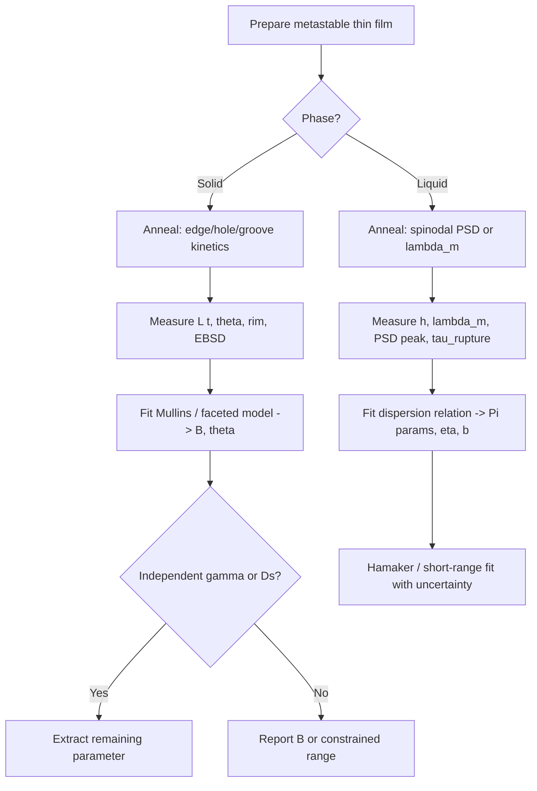

# Literature review: Using dewetting experiments to quantify interface energy and interface diffusivity

**Focus:** How **dewetting / agglomeration** experiments are used as **inverse metrology** — extracting **interfacial energies** (surface, film–substrate, disjoining pressure / Hamaker) and **interfacial transport coefficients** (surface, grain-boundary, and film–substrate interface diffusivity) from morphology and kinetics.

**Related notes:** [`dewetting_nonideal_substrate_mechanistic_models_review.md`](dewetting_nonideal_substrate_mechanistic_models_review.md) (mechanisms); [`solid_electrolyte_li_contact_surface_diffusion_review.md`](solid_electrolyte_li_contact_surface_diffusion_review.md) (Li|SE contact — different physics, but same “extract $D$ and $\gamma$ from interface evolution” mindset).

**Generated:** 2026-07-20

---

## Executive summary

Dewetting turns a **metastable thin film** into **holes, retracting edges, rims, and islands**. If a mechanistic model links observable **length scales** and **time scales** to material parameters, the experiment becomes a **quantitative probe** of interface thermodynamics and kinetics.

| Regime | Typical observables | Primary extracted quantities | Main references |
|--------|---------------------|------------------------------|-----------------|
| **Solid-state dewetting (SSD)** | Edge retraction distance $L(t)$, rim geometry, contact angle $\theta$, island aspect ratio | $\gamma$, $\gamma_\mathrm{int}$, $\theta$, **surface diffusivity** $D_s$ (often via $B = D_s\gamma\Omega^2\nu/k_BT$) | Mullins 1957; Kim *et al.* JAP 2013; Zucker *et al.* 2013; Dornel *et al.* PRB 2006 |
| **GB grooving / thermal etch** | Groove depth $w(t)\sim t^{1/4}$, groove angle | $D_s$; ratio $\gamma_\mathrm{GB}/\gamma$ | Mullins 1957; Robertson 1970; Martin 2009 |
| **Liquid spinodal dewetting** | Dominant wavelength $\lambda_m(h)$, growth rate $R_m(h)$, roughness PSD peak | **Hamaker** / disjoining-pressure parameters, $\gamma$, $\eta$; effective slip $b$ | Xie *et al.* PRL 1998; Rauscher *et al.* Langmuir 2008; Seemann / Jacobs groups |
| **Inverse / patterned substrates** | Early-time height field vs known chemical pattern | **Spatial map** of substrate–film interaction energy | Richter *et al.* JCP 2025 |
| **Interface (subsurface) diffusion** | Groove/hole kinetics faster than surface-only Mullins | **Interface diffusivity** $D_\mathrm{int}$ | Amram *et al.* *Acta Mater.* 2014 |

**Central caveat:** Energies and diffusivities are often **coupled** in the same observable (e.g. $B$ combines $D_s$ and $\gamma$). Quantitative dewetting metrology requires **independent anchors** (Wulff faceting, contact-angle goniometry, atomistic $\gamma$ tables, tracer diffusion, or multi-observable fits).

---

## 1. Why dewetting works as a measurement tool

Dewetting minimizes **excess interface area** subject to **mass conservation** and **transport-limited kinetics**. In the capillary / lubrication limit, observables reduce to combinations of:

- **Energies:** $\gamma$ (film–vapor), $\gamma_\mathrm{int}$ (film–substrate), $\gamma_\mathrm{GB}$ (grain boundary), disjoining pressure $\Pi(h)$ or Hamaker constant $A_H$.
- **Kinetics:** surface diffusivity $D_s$, interface diffusivity $D_\mathrm{int}$, GB diffusivity $D_\mathrm{GB}$, liquid viscosity $\eta$, slip length $b$.

The experiment supplies **geometry vs time**; the model supplies **constitutive relations**; fitting or scaling analysis yields parameters.

---

## 2. Solid-state dewetting: surface energy and surface diffusivity

### 2.1 Mullins backbone

For isotropic SSD driven by **surface self-diffusion**,


$$
V_n = -B\,\nabla_s^2\kappa, \qquad B = \frac{D_s\,\gamma\,\Omega^2\nu}{k_BT}.
$$


**Thompson** (*Annu. Rev. Mater. Res.* 2012) reviews SSD as capillary-driven agglomeration below $T_m$. [10.1146/annurev-matsci-070511-155048](https://doi.org/10.1146/annurev-matsci-070511-155048)

**What you measure:** retraction velocity of film edges, hole growth, rim height/width, final particle contact angle.

**What you infer:** $B$ (from kinetics) and $\theta$ (from equilibrium island shape) → **$D_s$ and $\gamma$ only if one is known independently**.

### 2.2 Edge retraction metrology (Thompson school)

**Kim, Zucker, Ye, Carter & Thompson** (*J. Appl. Phys.* 2013): systematic **quantitative** study of **anisotropic edge retraction** on single-crystal Ni/MgO.

- **Method:** lithographically defined macroscopic edges with known crystallographic orientations; measure $L(t)$, rim dimensions.
- **Scaling:** $L \sim t^n$ with $n \approx 0.4$; rim height/width $\sim t^{0.2}$ — consistent with faceted surface-diffusion model.
- **Anisotropy:** retraction rate varies with edge orientation; model uses **facet-resolved** $D_s$ and $\gamma$.
- **Identifiability:** agreement within **uncertainty of input $\gamma$ and $D_s$** from literature; MIT summary notes ~10% match for best orientation, larger errors otherwise — highlighting **parameter coupling**.

[10.1063/1.4788822](https://doi.org/10.1063/1.4788822)

**Zucker *et al.*** (*C. R. Physique* 2013): 2D **fully faceted** edge-retraction model; sensitivity analysis shows strongest rate control from **film thickness**, **top-facet $D_s$**, **contact angle**, and **$|\gamma|$**. Retraction distance scales $\propto h^{1/2}$ in the model. [10.1016/j.crhy.2013.06.005](https://doi.org/10.1016/j.crhy.2013.06.005)

**Dornel, Barbé, de Crécy, Lacolle & Eymery** (*Phys. Rev. B* 2006): **surface diffusion dewetting** theory for patterned crystalline films — foundation for extracting $D_s$ from edge/hole dynamics. [10.1103/PhysRevB.73.115427](https://doi.org/10.1103/PhysRevB.73.115427)

### 2.3 Contact angle and $\gamma_\mathrm{int}$ from equilibrium islands

After dewetting, **particle shape** at the three-phase contact line encodes the **Young angle** $\theta$:

$$
\gamma_\mathrm{int} = \gamma\cos\theta \quad \text{(isotropic, ideal)}.
$$

SSD reviews and Atiya/Kaplan-type studies use **faceted particles** and **low-index OR** with sapphire to infer **relative** $\gamma_\mathrm{int}$ anisotropy (slow retraction directions ↔ low interface energy). This is **semi-quantitative** when facets and OR are known from EBSD.

### 2.4 Rayleigh-like breakup → surface-energy anisotropy

**Kim & Thompson** (*Acta Mater.* 2014): particle spacing after wire breakup scales with radius but is **orientation-dependent**; links to $\gamma''/\gamma$ (Cahn-type anisotropy). Useful for **$\gamma(\mathbf{n})$** tomography, not $D_s$ alone. [10.1016/j.actamat.2014.10.028](https://doi.org/10.1016/j.actamat.2014.10.028)

---

## 3. Grain-boundary grooving: classic $D_s$ and $\gamma_\mathrm{GB}/\gamma$ extraction

**Mullins** (*J. Appl. Phys.* 1957): groove depth at GB–surface intersection grows as

$$
w(t) \sim (B t)^{1/4}
$$

for surface-diffusion-controlled grooving. Groove **angle** at the root relates to $\gamma_\mathrm{GB}/\gamma$. [10.1063/1.1722742](https://doi.org/10.1063/1.1722742)

**Robertson** (*Scripta Metall.* 1970) and many ceramic/metal studies: **surface self-diffusion coefficients** of Cu, Ag, etc. from grooving/etch experiments.

**Martin** (*Proc. R. Soc. A* 2009): revisits Mullins with Fourier methods; multi-groove interactions.

**Use in thin films:** When polycrystalline films dewet, **GB grooving** precedes or accompanies hole formation (**Srolovitz & Safran** 1986). Groove kinetics on **free film surfaces** remain the cleanest $D_s$ probe; coupling to **through-thickness rupture** is more complex.

**Limitation:** Apparent $D_s$ from grooving can include **step-edge**, **adatom**, and **GB** contributions if microstructure is fine — Krauskopf-style critique of “fast pathways” in Li applies analogously to metals.

---

## 4. Interface diffusivity (film–substrate) from dewetting

Surface diffusion alone often **cannot** explain:

- **Flat hole rims** with mass accumulating in **distant hillocks** (Fe/sapphire — GB/interface transport).
- **Accelerated grooving** when subsurface paths are open.

**Amram, Klinger, Gazit, Gluska & Rabkin** (*Acta Mater.* 2014): **“Grain boundary grooving in thin films revisited: the role of interface diffusion.”**

- Extends Mullins-type analysis to include **interface diffusion** along the film–substrate boundary.
- Shows interface transport can **dominate** groove/hole kinetics even when surface diffusion is slow.
- Provides framework to extract **$D_\mathrm{int}$** if surface term is separately bounded.

[10.1016/j.actamat.2014.02.008](https://doi.org/10.1016/j.actamat.2014.02.008)

**Derkach, Novick-Cohen & Rabkin** (*Scripta Mater.* 2017): GB effects on **hole morphology and growth** during SSD — links microstructure to effective interface transport. [10.1016/j.scriptamat.2017.02.046](https://doi.org/10.1016/j.scriptamat.2017.02.046)

**Klinger & Rabkin** (*Scripta Mater.* 2011): retracting edge with **high surface anisotropy** — when surface diffusion is facet-blocked, **interface/GB paths** set kinetics.

**Practical reading:** If dewetting kinetics exceed Mullins predictions using literature $D_s$, suspect **$D_\mathrm{int}$ or $D_\mathrm{GB}$** — do not force-fit a single surface $D_s$.

---

## 5. Liquid-film dewetting: disjoining pressure, Hamaker constant, and viscosity

### 5.1 Spinodal wavelength scaling

For spinodally unstable liquid/polymer films, linear analysis gives a **fastest-growing wavelength** $\lambda_m$ that depends on $h$, $\gamma$, $\eta$, and the **second derivative of disjoining pressure** $\Pi''(h)$ (often parameterized by **Hamaker constant** $A_H$ for van der Waals films).

**Xie, Karim, Douglas, Han & Weiss** (*PRL* 1998): PS on Si — $\lambda_m \propto h^2$; growth rate $R_m(h)$ matches capillary-wave model when $A$, $\gamma$, $\eta$ are taken from literature → **consistency check** rather than de novo $A$ extraction. [10.1103/PhysRevLett.81.1251](https://doi.org/10.1103/PhysRevLett.81.1251)

**Bischof *et al.*** (*PRL* 1996): liquid metals — $\lambda_m \propto h^2$ with prefactor tied to dispersive interactions. [10.1103/PhysRevLett.77.1536](https://doi.org/10.1103/PhysRevLett.77.1536)

### 5.2 Power-spectrum / PSD methods

Modern approach: measure **height roughness PSD** during early spinodal dewetting; compare peak position and growth to **dispersion relation** $R(q)$.

**Rauscher, Blossey, Münch & Wagner** (*Langmuir* 2008): **large slip** shifts PSD peak — methods that infer $\Pi(h)$ from PSD must include **slip length** $b$ or $A_H$ is biased. [10.1021/la802260b](https://doi.org/10.1021/la802260b)

**Jacobs / Seemann / Mecke groups** (*Comm. Phys.* 2023 and related): combine **Hamaker constant**, short-range repulsion, **viscosity**, and **slip** in linear stability; fit $\lambda_m(h)$ and rupture times — explicit uncertainty budgets on $A_H$ (e.g. $\pm 0.4\times10^{-20}$ J scale for PS/PMMA).

[10.1038/s42005-023-01208-x](https://doi.org/10.1038/s42005-023-01208-x)

**Seemann *et al.*** multilayer **Hamaker function** analysis: dewetting on **metallic underlayers** requires **retardation** and layered $A$ — naive two-slab $A_H$ underestimates instability thickness.

### 5.3 What is actually “interface energy” here?

For liquids, **$\Pi(h)$** encodes **effective substrate–film interaction** (van der Waals, polar, structural). Fitting spinodal data yields:

- **$A_H$** (or $\Pi''$ at working $h$) — effective **interaction energy per area** in the thin-film limit.
- Not the same object as **solid $\gamma_\mathrm{int}$**, but operationally the **substrate wettability / adhesion** parameter controlling rupture.

---

## 6. Inverse problem: inferring spatial interface-energy maps

**Richter, Malgaretti & Harting** (*J. Chem. Phys.* 2025):

- **Forward model:** thin-film equation + linear stability on **chemically patterned** flat substrates.
- **Inverse claim:** early-time height profiles can **measure surface-energy patterns** (spatial $\Pi$ or $\gamma_\mathrm{int}$ variation) with good precision.
- **Significance:** extends dewetting from **scalar** $A_H$ or $\theta$ to **mapping** heterogeneous interface energy — directly relevant to non-ideal substrates (see dewetting mechanisms review).

[10.1063/5.0268099](https://doi.org/10.1063/5.0268099)

---

## 7. Method comparison and identifiability

| Method | Strengths | Weaknesses | Best for |
|--------|-----------|------------|----------|
| **Edge retraction $L(t)$** | Direct $B$; works on solids; anisotropy-resolved | Needs $h$, facet $D_s$, $\gamma$ inputs; 3D rim effects | SSD $D_s$, $\gamma$ consistency |
| **GB grooving $w(t^{1/4})$** | Classic; decouples geometry if groove angle measured | Bulk vs surface path ambiguity; high $T$ | Metal/ceramic $D_s$ |
| **Spinodal $\lambda_m(h)$** | Sensitive to $\Pi''(h)$ / $A_H$; parallel to many films | Needs small-$h$ data; slip/thermal noise | Polymer/metallic **liquid** films |
| **PSD peak fitting** | Rich linear-regime statistics | Many parameters ($A$, $B$, $n$, $b$, $\eta$) | Full $\Pi(h)$ parameterization |
| **Equilibrium island $\theta$** | $\gamma_\mathrm{int}$ from Young | Assumes equilibrium; faceting complicates | Solid **$\gamma_\mathrm{int}/\gamma$** |
| **Interface diffusion grooving** | Access **$D_\mathrm{int}$** | Requires surface term control | Metal films on oxides |

### 7.1 Coupling rules (avoid over-interpretation)

1. **$B = D_s \gamma \times \text{const}$** — measuring $B$ from one velocity does **not** give both $D_s$ and $\gamma$.
2. **Thickness $h$** enters edge retraction as $\sqrt{h}$ scaling (Zucker) — must be controlled or measured.
3. **Anisotropy:** scalar $\gamma$ and $D_s$ fits fail on single-crystal SSD; need **facet-resolved** tables.
4. **Non-ideal substrates:** chemical patterns invert to **effective** energies (Richter); real $\gamma_\mathrm{int}$ may differ from homogeneous fit.
5. **Liquid vs solid:** spinodal **$\lambda_m$** methods do **not** transfer directly to **SSD** without re-deriving physics (no $\eta$; different boundary condition at contact line).

---

## 8. Workflow sketch for a quantitative dewetting experiment



---

## 9. Relevance to battery / solid-interface communities

Dewetting **metrology** is rarely applied **in situ** to Li|SE cells, but the **same inverse logic** appears:

- Extract **$D_s$ or $D_\mathrm{int}$** from **void/contact-area kinetics** (Krauskopf, Yan, Banerjee) rather than from SSD rim profiles.
- **$\gamma_\mathrm{int}$ / $W_\mathrm{ad}$** from **contact angle** or **wetting** tests — analogous to island $\theta$ after agglomeration.

SSD dewetting literature is the **cleaner calibration ground** because **geometry is visible** (AFM/SEM) and **$T$ is well-defined**. Li|SE voiding adds **electrochemistry** and **stack pressure**, but benefits from the same **identifiability discipline**: never fit $D$ and $\gamma$ from a single scalar observable without anchors.

---

## 10. Key papers

| Topic | Reference | DOI |
|-------|-----------|-----|
| SSD overview | Thompson, *Annu. Rev. Mater. Res.* 2012 | [10.1146/annurev-matsci-070511-155048](https://doi.org/10.1146/annurev-matsci-070511-155048) |
| GB grooving / $D_s$ | Mullins, *J. Appl. Phys.* 1957 | [10.1063/1.1722742](https://doi.org/10.1063/1.1722742) |
| Quantitative edge retraction | Kim *et al.*, *J. Appl. Phys.* 2013 | [10.1063/1.4788822](https://doi.org/10.1063/1.4788822) |
| Faceted SSD model + sensitivity | Zucker *et al.*, *C. R. Physique* 2013 | [10.1016/j.crhy.2013.06.005](https://doi.org/10.1016/j.crhy.2013.06.005) |
| Surface diffusion dewetting theory | Dornel *et al.*, *Phys. Rev. B* 2006 | [10.1103/PhysRevB.73.115427](https://doi.org/10.1103/PhysRevB.73.115427) |
| Interface diffusion in grooving | Amram *et al.*, *Acta Mater.* 2014 | [10.1016/j.actamat.2014.02.008](https://doi.org/10.1016/j.actamat.2014.02.008) |
| Spinodal $\lambda_m$, $R_m$ | Xie *et al.*, *PRL* 1998 | [10.1103/PhysRevLett.81.1251](https://doi.org/10.1103/PhysRevLett.81.1251) |
| PSD + slip + Hamaker | Rauscher *et al.*, *Langmuir* 2008 | [10.1021/la802260b](https://doi.org/10.1021/la802260b) |
| Hamaker fit with uncertainty | Seemann group, *Comm. Phys.* 2023 | [10.1038/s42005-023-01208-x](https://doi.org/10.1038/s42005-023-01208-x) |
| Inverse surface-energy mapping | Richter *et al.*, *JCP* 2025 | [10.1063/5.0268099](https://doi.org/10.1063/5.0268099) |
| $\gamma$ anisotropy from breakup | Kim & Thompson, *Acta Mater.* 2014 | [10.1016/j.actamat.2014.10.028](https://doi.org/10.1016/j.actamat.2014.10.028) |

---

## 11. Suggested reading order

1. Thompson 2012 — what SSD can and cannot tell you  
2. Mullins 1957 — grooving → $D_s$  
3. Kim *et al.* 2013 + Zucker 2013 — quantitative SSD edge metrology  
4. Xie 1998 + Rauscher 2008 — liquid spinodal → $\Pi(h)$ / $A_H$  
5. Amram 2014 — when **interface diffusivity** matters  
6. Richter 2025 — spatial inverse problem on patterned substrates  

---

## References (BibTeX snippet)

```bibtex
@article{Kim2013JAP,
  author  = {Kim, Gye Hyun and Zucker, Rachel V. and Ye, Jongpil and Carter, W. Craig and Thompson, Carl V.},
  title   = {Quantitative analysis of anisotropic edge retraction by solid-state dewetting of thin single crystal films},
  journal = {Journal of Applied Physics},
  year    = {2013},
  doi     = {10.1063/1.4788822}
}
@article{Amram2014,
  author  = {Amram, Dor and Klinger, Leonid and Gazit, Nimrod and Gluska, Hadar and Rabkin, Eugen},
  title   = {Grain boundary grooving in thin films revisited: The role of interface diffusion},
  journal = {Acta Materialia},
  year    = {2014},
  doi     = {10.1016/j.actamat.2014.02.008}
}
@article{Richter2025,
  author  = {Richter, Tilman and Malgaretti, Paolo and Harting, Jens},
  title   = {Modeling of the dewetting of ultra-thin liquid films on chemically patterned substrates: Linear spectrum and deposition patterns},
  journal = {The Journal of Chemical Physics},
  year    = {2025},
  doi     = {10.1063/5.0268099}
}
```
