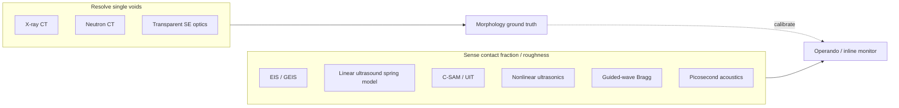

# Literature review: Non-destructive detection of voids at metal | solid-electrolyte interfaces

**Focus:** Non-destructive (and preferably *operando*-compatible) ways to detect **interfacial voids** at metal | solid electrolyte (M|SE) contacts — especially when a **single void is below the spatial resolution of most probes**, but an **array of somewhat periodic voids** (or a change in **effective interface roughness / contact fraction**) may be detectable via **wave-based** methods.

**Scope:** ASSB literature **plus** adjacent fields with analogous **solid–solid interface defects**: diffusion bonding, wafer hybrid bonding, adhesive/kissing bonds, tribological rough contacts, aerospace NDE.

**Related notes:** [`li_se_void_formation_mechanisms_sites_review.md`](li_se_void_formation_mechanisms_sites_review.md); [`solid_electrolyte_li_contact_surface_diffusion_review.md`](solid_electrolyte_li_contact_surface_diffusion_review.md).

**Generated:** 2026-07-21

---

## Executive summary

| Question | Short answer |
|----------|--------------|
| Can a **single** micron/sub-micron void at a buried M\|SE interface be seen NDE? | Usually **no**, except with high-resolution **X-ray / neutron tomography** (facility-limited) or specialized high-frequency acoustics / picosecond acoustics on thin stacks. |
| Is an **array** of voids / roughness change more detectable? | **Yes.** Wave methods sense **ensemble** interface properties (stiffness, contact fraction, coherent Bragg scattering), not individual scatterers. |
| Best lab-accessible proxy in ASSBs today? | **Electrochemical impedance** (ensemble contact loss) + occasional **tomography** for ground truth. **Ultrasound / SAM / nonlinear ultrasonics** are underexploited relative to bonding/tribology NDE. |
| Most transferable external toolkit? | **Baik–Thompson spring model** ultrasonics; **C-SAM**; **nonlinear / kissing-bond** ultrasonics; **guided-wave phonon** matching to periodic roughness; **picosecond laser ultrasonics**; (selectively) **THz / IR / optical** through transparent or thin windows. |

**Central physics:** When the ultrasonic (or electromagnetic) wavelength $`\lambda`$ is **large** compared with individual gap size $`a`$, the interface behaves as a **distributed spring** of stiffness $`K`$ (per unit area). Reflection/transmission depends on $`K(\omega)`$, which tracks **real contact area fraction** and gap population — even when **no single void is resolved**. When voids or grooves are **quasi-periodic** with period $`\Lambda`$, an additional **coherent / Bragg (“phonon”)** channel opens near $`k \approx 2\pi/\Lambda`$, often giving a sharper spectral signature than random roughness of the same RMS height.

---

## 1. What “void detection” means at M|SE

Interfacial voids at Li|SE (and analogous Na|SE, etc.) are **regions of lost solid–solid contact** — typically vacuum/gas gaps of height from **tens of nm to tens of µm**, lateral size from **sub-µm to hundreds of µm**, often **nucleating from roughness asperities** and growing during stripping (see void-mechanism review).

Detection goals differ:

1. **Resolve one void** (morphology, location) → needs **imaging** with voxel size $`\lesssim`$ void size.
2. **Sense that contact has degraded** (area fraction, effective roughness) → can use **ensemble / wave** observables.
3. **Map a spatial pattern** of many voids → intermediate; benefits from **coherent scattering** if the pattern has a characteristic length $`\Lambda`$.

NDE constraint for batteries: preserve the cell; ideally work **operando** under stack pressure and current; penetrate **mm-scale** electrodes, current collectors, and dense ceramics/sulfides.

---

## 2. Direct volumetric imaging (gold standard for single voids)

### 2.1 Synchrotron / lab X-ray CT

**Lewis, McDowell *et al.*** (*Nat. Mater.* 2021): operando synchrotron **X-ray microtomography** of Li | Li$`_{10}`$SnP$`_2`$S$`_{12}`$ | Li — directly visualizes **void formation during stripping**, quantifies contact loss, and links it to electrochemical failure. [10.1038/s41563-020-00903-2](https://doi.org/10.1038/s41563-020-00903-2)

**Hao *et al.*** (*Nano Energy* 2021): in-situ synchrotron XCT tracking Li / cracks in sulfide SE with ~µm resolution. [10.1016/j.nanoen.2021.105744](https://doi.org/10.1016/j.nanoen.2021.105744)

**Limits:** Li contrast is weak (low $`Z`$); lab CT often needs long scans; true **sub-µm** voids need synchrotron or nano-CT. Excellent for **validation**, poor as a routine cell monitor.

### 2.2 Neutron radiography / tomography

Neutrons have **high Li contrast** and penetrate metals well.

**Zhang, Chandran, Bilheux *et al.*** (*J. Electrochem. Soc.* 2017): neutron CT of **Li–Mg** electrode delithiation — quantitative Li spatial maps. [10.1149/2.0051702jes](https://doi.org/10.1149/2.0051702jes)

**Cao *et al.*** (OSTI / related work): operando **neutron imaging + XCT** of soft shorts / Li creep in ASSBs.

**Limits:** beamtime, spatial resolution typically **tens of µm** (better at specialized instruments), slow for true 3D *operando* at high rate.

### 2.3 Neutron depth profiling / reflectometry (nanoscale interphase, not voids)

**NDP / NR** probe **compositional** buried interphases (nm–µm) rather than open voids; complementary for chemistry, not morphology of µm voids. (Recent comparative Li|LiPON study: [10.1039/D5TA05758B](https://doi.org/10.1039/D5TA05758B))

### 2.4 Optical microscopy through transparent SE

Transparent **Al-doped LLZO** enables **operando video microscopy** of voids down to ~**2 µm** features without tomography (ECS meeting reports, 2025). Powerful for mechanism studies; **not** general (requires transparent ceramic + specialized cell).

**Verdict on single voids:** tomography / transparent optics remain the only reliable **individual-void** NDE paths. Most other methods detect **ensembles**.

---

## 3. Ensemble electrochemical proxies (ASSB standard practice)

**Operando GEIS / EIS** is the workhorse: rising **interfacial resistance** tracks **contact-area loss** during stripping (Krauskopf *et al.*, *Adv. Energy Mater.* 2019, [10.1002/aenm.201902568](https://doi.org/10.1002/aenm.201902568); Lu *et al.*, *Sci. Adv.* 2022).

| Pros | Cons |
|------|------|
| True *operando*; cheap; cell-agnostic | **No spatial map**; conflates voids, interphase growth, SE cracks, filament soft-shorts |
| Sensitive to **small** contact-area changes via constriction | Cannot distinguish **one large** void from **many small** ones |

EIS answers “has contact degraded?” not “where / what morphology?”. Wave methods can add **mechanical** contact information orthogonal to electrochemistry.

---

## 4. Wave-based methods: why arrays beat single voids

### 4.1 Scale regimes

Consider an acoustic wavelength $`\lambda = c/f`$ in the solid ($`c\sim 2`$–$`6`$ km/s; $`f = 1`$–$`100`$ MHz ⇒ $`\lambda \sim 30`$ µm–6 mm).

| Regime | Condition | Observable |
|--------|-----------|------------|
| **Rayleigh / single-scatterer** | $`\lambda \gg a`$, isolated void | Scattered amplitude $`\propto`$ small; hard to see one void |
| **Quasi-static spring (QSA)** | $`\lambda \gg`$ gap width & spacing | Reflection $`R(\omega)`$ set by **interface stiffness** $`K`$ |
| **Bragg / phonon** | $`\lambda \sim 2\Lambda`$ (period $`\Lambda`$) | Spectral **dips / mode conversion** from **periodic** gap array |
| **Imaging (SAM)** | focused high-$`f`$ beam, $`\lambda`$ comparable to feature | C-scan map of **local** reflection |

**Key point for the user’s question:** a **periodic or quasi-periodic void array** with period $`\Lambda`$ can be detected even when **each void is unresolved**, because:

1. **Many small gaps** reduce average $`K`$ → finite $`|R|`$ in the QSA (Sect. 4.2).
2. **Periodicity** concentrates scattering into **coherent orders** near Bragg conditions (Sect. 4.3) — a spectral fingerprint that random roughness lacks at the same RMS amplitude.
3. **Roughness / contact-fraction change** is exactly what tribology ultrasonics already measures as “real area of contact” proxies.

### 4.2 Baik–Thompson spring model (imperfect solid–solid interfaces)

**Baik & Thompson** (*J. Nondestruct. Eval.* 1984): imperfect interfaces as continuous **normal/tangential springs** $`K_N`$, $`K_T`$. [10.1007/BF00566223](https://doi.org/10.1007/BF00566223)

Boundary conditions (schematic):

$$
\sigma_{zz} = K_N \,\Delta u_z, \qquad \sigma_{xz} = K_T \,\Delta u_x.
$$

For normal incidence, the **reflection coefficient** of a thin imperfect interface is frequency-dependent through $`K_N`$; measuring $`R(f)`$ recovers $`K_N`$.

**Drinkwater, Dwyer-Joyce & Cawley** (*Proc. R. Soc. A* 1996): ultrasonic reflection from **partially contacting rough Al–Al** interfaces — spring model fits; stiffness tracks load / contact evolution. [10.1098/rspa.1996.0139](https://doi.org/10.1098/rspa.1996.0139)

**Dwyer-Joyce, Drinkwater & Quinn** (*ASME J. Tribol.* 2001): ultrasound as a probe of **rough-surface contact**; number of asperity contacts vs load. [10.1115/1.1330740](https://doi.org/10.1115/1.1330740)

**Transfer to M|SE:** stripping-induced voids = **reduction of real contact area** = **drop in $`K_N`$** = **rise in ultrasonic reflection** (or drop in transmission) at the interface — **without resolving individual voids**. Stack pressure plays the role of the tribology “load” calibration.

**Caveat (Kendall–Tabor):** $`K`$ depends on **size, number, and spacing** of contact patches — not uniquely on area fraction. Still a powerful **monotonic** indicator of contact degradation.

### 4.3 Periodic voids / roughness: Bragg and guided-wave “phonon” signatures

**Angel & Achenbach** (*J. Appl. Mech.* 1985): reflection/transmission by a **periodic array of cracks** — coherent scattering orders. [10.1115/1.3169023](https://doi.org/10.1115/1.3169023)

**Potel, Leduc, Izbicki *et al.*** (*JASA* 2017): SH guided waves in **metal–adhesive–metal** with **periodic triangular grooves** ($`\Lambda = 3.7`$ mm). Transmission shows a **minimum at the phonon (phase-matching) frequency**; retro-converted modes appear **only when periodicity is present** (vanish for a single groove). [experimental PDF context](https://perso.univ-lemans.fr/~cpotel/rugosite_SH_exp_JASA_vol_141iss_64591_1.pdf)

**Implication:** if Li|SE voids organize with a characteristic spacing $`\Lambda`$ (e.g. set by SE grain size, lithography, or roughness correlation length), tune frequency / angle so that

$$
\mathbf{k}_\mathrm{incident} - \mathbf{k}_\mathrm{scattered} \approx \frac{2\pi}{\Lambda}\,\hat{\mathbf{n}}_\mathrm{period}
$$

and look for **spectral notches**, **mode conversion**, or **enhanced backscatter** — a clearer NDE signature than broadband RMS roughness alone.

### 4.4 Scanning acoustic microscopy (SAM / C-SAM)

Industrial standard for **wafer bonding voids**, package delamination, diffusion-bond gaps:

- **C-SAM** maps interface echo amplitude/phase; HR modes ~**4–20 µm** pixels; can sense **sub-resolution void density** as grayscale (moiré / partial-bond contrast in hybrid bonding).
- Used for **Ti diffusion bonds**, MEMS hermetic seals, multi-tier 3D stacks (smallest detectable void size depth-dependent).
- **Zhang *et al.*** (2025): ultrasonic imaging of SSB **in-situ solidification / formation** — early ASSB manufacturing NDE, not yet void-morphology science. [10.33140/jass.03.01.01](https://doi.org/10.33140/jass.03.01.01)

**Transfer:** SAM-style pulse-echo focused on the M|SE plane is the most direct hardware path to **map contact quality** in flat cells; coupling (water immersion vs dry/contact) and Li softness are engineering issues.

### 4.5 Nonlinear ultrasonics / kissing bonds

**Kissing bonds** = closed, low-adhesion contacts with **near-zero gap** — invisible to linear ultrasound (no impedance mismatch) but strong **contact acoustic nonlinearity** (CAN): harmonics, wave mixing, local damage resonance.

- **Alston, Croxford *et al.***: non-collinear wave mixing for kissing bonds. [10.1016/j.ndteint.2018.07.003](https://doi.org/10.1016/j.ndteint.2018.07.003)
- **Solodov *et al.***: nonlinear laser vibrometry; higher harmonics locate kissing bonds. [10.1121/2.0001666](https://doi.org/10.1121/2.0001666)
- **Diffusion-bond nonlinear C-scan**: nonlinear parameter ~**10×** higher at contact-type defects than at open ~10 µm gaps. [10.3390/ma17061288](https://doi.org/10.3390/ma17061288)

**Transfer to Li|SE:** early stripping often produces **partial / “kissing” contacts** and **re-closed** voids under stack pressure — exactly where **linear** methods fail and **nonlinear** methods shine. Highly relevant, barely used in ASSB literature.

### 4.6 Picosecond laser ultrasonics (APiC / PLA)

**Colored picosecond acoustics** vs SAM on **hybrid wafer bonding**: APiC resolves **1–2 µm** laterally and detects **void density** variations below SAM’s ~20 µm resolution via interface echo amplitude. [10.48465/fa.2020.0878](https://doi.org/10.48465/fa.2020.0878)

**Transfer:** needs optical access to a thin stack (or thinned current collector). Attractive for **model thin-film Li|SE** cells, less so for thick pouch cells.

### 4.7 Electromagnetic / optical companions

| Method | Strength | Relevance to M\|SE |
|--------|----------|-------------------|
| **THz-TDS** | Sensitive to **air gaps / delamination** in dielectrics & bonds | Promising if SE is THz-transparent enough; metals block THz — need edge / window access |
| **IR transmission** (Si wafers) | Fast large-void maps in bonding | Needs IR-transparent electrodes/SE |
| **Lock-in thermography / photoacoustics** | Delamination contrast via thermal resistance | Possible under modulated current / laser; spatial resolution limited |
| **Acoustic emission** | Detects **sudden** crack/void events | Event timing, not morphology |

---

## 5. Cross-field method map → ASSB exploitability



| Field | Defect type | Method | Exploit for Li\|SE? |
|-------|-------------|--------|---------------------|
| Tribology NDE | Rough solid–solid contact | $`R(f)\to K_N`$ | **High** — same physics as voided contact |
| Aerospace diffusion bonds | µm interfacial gaps | Focused UT, Kirchhoff models | **High** for flat cells |
| Wafer hybrid bonding | nm–µm voids | C-SAM, APiC, IR | **Medium** — thin-stack cells |
| Adhesive joints | Kissing bonds | Nonlinear UT / CAN | **High** for pressurized partial contact |
| Laminate SHM | Periodic roughness / delam | Guided-wave phonon matching | **Medium–high** if voids are patterned / periodic |
| Polymer/dielectric NDE | Air gaps | THz-TDS | **Low–medium** (metal electrodes block) |

---

## 6. Direct answer: are periodic void arrays more wave-detectable?

**Yes — in two complementary ways:**

1. **Even without periodicity (random array):** if $`\lambda \gg a`$, the QSA applies. An array of sub-resolution voids lowers $`K_N`$ and raises $`|R|`$ (or lowers transmission). Detectability scales with **contact-area deficit**, not with resolving one void. This is already validated on **rough metal contacts** (Drinkwater / Dwyer-Joyce).

2. **With quasi-periodicity (period $`\Lambda`$):** an extra **coherent channel** appears near Bragg / phonon conditions. Experiments on **periodic groove arrays** in bonded plates show transmission minima and mode conversion that **disappear when periodicity is removed**. So a “somewhat periodic” void field (e.g. correlated with SE grain structure or engineered roughness) is **spectrally more distinctive** than the same void volume randomly placed.

**Practical design rule for an ASSB ultrasonic experiment:**

- Choose $`f`$ so $`\lambda`$ is **large vs void height** (QSA valid) but **comparable to or longer than** expected $`\Lambda`$ if seeking Bragg features.
- Measure **interface echo** $`R(f)`$ vs cycle number / stack pressure; invert to $`K_N(t)`$.
- Optionally sweep angle/frequency for **phonon matching** if PSD of interface morphology shows a peak at $`\Lambda`$.
- Calibrate against **one** XCT / transparent-LLZO dataset.

---

## 7. What is hard specifically for Li|SE

1. **Soft Li** attenuates and complicates coupling; plastic flow changes contact under the transducer load.
2. **Acoustic impedance** of Li vs oxide/sulfide SE already mismatches — baseline interface echo exists even for “perfect” contact; need **differential** $`R`$ vs state-of-charge / cycle.
3. **Interphase layers** (Li$`_2`$S, Li$`_3`$P, etc.) add thin-layer reflections that can mimic weak bonds — multi-frequency / multi-mode separation required (cf. adhesive-joint spectroscopy).
4. **Stack pressure** simultaneously heals voids **and** changes $`K_N`$ — same coupling that tribology exploits, but must be controlled.
5. **Safety / atmosphere:** water-immersion SAM vs glovebox-compatible dry UT.

None of these are fundamental show-stoppers; they are **metrology engineering** problems already faced in diffusion bonding and package inspection.

---

## 8. Recommended reading order

1. Baik & Thompson 1984 — spring model  
2. Drinkwater *et al.* 1996 + Dwyer-Joyce review (ultrasound in tribology) — contact fraction ↔ $`R`$  
3. Lewis *et al.* 2021 — XCT ground truth for Li\|SE voids  
4. Potel *et al.* 2017 — periodic roughness → guided-wave phonon signature  
5. Nonlinear kissing-bond papers (Alston / Solodov) — closed contacts  
6. SAM / APiC hybrid-bonding papers — industrial void mapping practice  
7. Krauskopf 2019 — EIS as the electrochemical ensemble baseline  

---

## 9. Open opportunities (methods to exploit next)

1. **Operando ultrasonic $`K_N(t)`$** on Li|LLZO or Li|sulfide symmetric cells under controlled stack pressure — calibrate vs XCT once.  
2. **Nonlinear UT** during early stripping (kissing / partial contact) before open voids appear in tomography.  
3. **Engineered periodic roughness** on SE as a **designed Bragg tag** to amplify wave contrast for metrology (and possibly to study void nucleation sites).  
4. **C-SAM-style mapping** of flat thin cells after formation — manufacturing QC transfer from wafer bonding.  
5. **Multi-physics fusion:** EIS (electronic/ionic constriction) + ultrasound (mechanical contact) to separate interphase growth from voiding.

---

## Key papers

| Topic | Reference | DOI |
|-------|-----------|-----|
| Operando XCT voids Li\|SSE | Lewis *et al.*, *Nat. Mater.* 2021 | [10.1038/s41563-020-00903-2](https://doi.org/10.1038/s41563-020-00903-2) |
| Neutron CT Li distribution | Zhang *et al.*, *JES* 2017 | [10.1149/2.0051702jes](https://doi.org/10.1149/2.0051702jes) |
| Ultrasonic spring model | Baik & Thompson, *JNDE* 1984 | [10.1007/BF00566223](https://doi.org/10.1007/BF00566223) |
| Rough contact ultrasonics | Drinkwater *et al.*, *Proc. R. Soc. A* 1996 | [10.1098/rspa.1996.0139](https://doi.org/10.1098/rspa.1996.0139) |
| Ultrasound ↔ contact mechanics | Dwyer-Joyce *et al.*, *J. Tribol.* 2001 | [10.1115/1.1330740](https://doi.org/10.1115/1.1330740) |
| Periodic crack array scattering | Angel & Achenbach, *JAM* 1985 | [10.1115/1.3169023](https://doi.org/10.1115/1.3169023) |
| Periodic roughness SH phonons | Potel *et al.*, *JASA* 2017 | (see Univ. Le Mans PDF / JASA 141, 4591) |
| Kissing-bond nonlinear UT | Alston *et al.*, *NDT&E Int.* 2018 | [10.1016/j.ndteint.2018.07.003](https://doi.org/10.1016/j.ndteint.2018.07.003) |
| Nonlinear C-scan diffusion bonds | *Materials* 2024 | [10.3390/ma17061288](https://doi.org/10.3390/ma17061288) |
| Picosecond acoustics vs SAM | Bossut *et al.*, Forum Acusticum 2020 | [10.48465/fa.2020.0878](https://doi.org/10.48465/fa.2020.0878) |
| UIT for SSB manufacturing | Zhang *et al.*, *JASS* 2025 | [10.33140/jass.03.01.01](https://doi.org/10.33140/jass.03.01.01) |
| EIS contact loss (ASSB) | Krauskopf *et al.*, *AEM* 2019 | [10.1002/aenm.201902568](https://doi.org/10.1002/aenm.201902568) |

---

## References (BibTeX snippet)

```bibtex
@article{Lewis2021NatMater,
  author  = {Lewis, John A. and others},
  title   = {Linking void and interphase evolution to electrochemistry in solid-state batteries using operando X-ray tomography},
  journal = {Nature Materials},
  year    = {2021},
  doi     = {10.1038/s41563-020-00903-2}
}
@article{BaikThompson1984,
  author  = {Baik, Jai-Man and Thompson, R. B.},
  title   = {Ultrasonic scattering from imperfect interfaces: A quasi-static model},
  journal = {Journal of Nondestructive Evaluation},
  year    = {1984},
  doi     = {10.1007/BF00566223}
}
@article{Drinkwater1996,
  author  = {Drinkwater, B. W. and Dwyer-Joyce, R. S. and Cawley, P.},
  title   = {A study of the interaction between ultrasound and a partially contacting solid--solid interface},
  journal = {Proceedings of the Royal Society A},
  year    = {1996},
  doi     = {10.1098/rspa.1996.0139}
}
```
